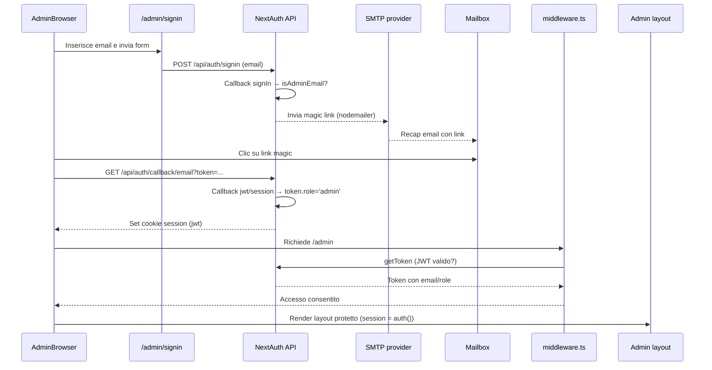

# Autenticazione (NextAuth v5)

## Configurazione
- File principale: `src/lib/auth.ts` esporta `authConfig` con adapter Prisma (`PrismaAdapter(prisma)`), `session.strategy='jwt'` e `trustHost=true`.
- Provider: email magic link (`next-auth/providers/email`) con SMTP configurato tramite env (`SMTP_HOST`, `SMTP_PORT`, `SMTP_USER`, `SMTP_PASS`, `MAIL_FROM`). Link valido 10 minuti (`maxAge`).
- Callback `signIn`:
  - Recupera email dall'utente o dal payload.
  - Verifica whitelist `isAdminEmail` (`src/lib/admin/emails.ts` legge `ADMIN_EMAILS`).
  - Se l'utente non è autorizzato ma il provider l'ha creato, viene cancellato (`prisma.user.delete`).
- Callback `jwt` aggiunge `token.role = 'admin'` per email whitelisted.
- Callback `session` propaga `session.user.id` e `session.user.role` per l'interfaccia admin.
- Pagine personalizzate: `signIn: '/admin/signin'`, `error: '/admin/not-authorized'`.

## Flow magic link (email)

## Middleware & layout
- Middleware (`src/middleware.ts`, vedere `src/_middleware.ts.off`):
  - Viene applicato a `/admin/:path*`.
  - Permette sempre asset statici, NextAuth e `/admin/signin`.
  - Usa `getToken` con `NEXTAUTH_SECRET`; se assente reindirizza a `/admin/signin?from=<pathname>`.
- Layout protetto: `src/app/admin/(protected)/layout.tsx` esegue `const session = await auth()` server-side e reindirizza se `!session.user?.email`.
- Provider client: `AdminProviders` avvolge la UI con `SessionProvider(session)`; `AdminNav` riceve `userEmail` per mostrare l'utente e il pulsante logout (`signOut({ callbackUrl: '/admin/signin' })`).

## Pagine collegate
- `/admin/signin`: form React + gestione errori (`AccessDenied`, `Configuration`). Legge `?from=` per redirect post-login.
- `/admin/not-authorized`: pagina informativa per email fuori whitelist.
- `/admin` e sotto cartelle `(protected)` richiedono sessione admin valida.

## Risoluzione problemi comuni
### Loop redirect su `/admin`
1. Verifica cookie `next-auth.session-token` nel browser (non deve essere `undefined`).
2. Controlla che `NEXTAUTH_SECRET` lato server corrisponda a quello usato per generare il token (variazioni forzano logout).
3. Conferma che l'email usata sia presente in `ADMIN_EMAILS` (case insensitive, separata da virgole o punto e virgola).
4. Controlla i log: `src/lib/auth.ts` stampa warning se non riesce a cancellare utenti non autorizzati.
5. In locale, richiama `GET /api/admin/_whoami` per ispezionare token ed env correnti.

### Errore NextAuth "Configuration"
- Mancano variabili: `NEXTAUTH_URL`, `AUTH_URL`, `NEXTAUTH_SECRET`, `SMTP_HOST`, `SMTP_PORT`, `SMTP_USER`, `SMTP_PASS`, `MAIL_FROM`.
- URL inconsistenti: assicurati che `NEXTAUTH_URL` e `AUTH_URL` coincidano con il dominio richiesto (es. `https://www.lasoluzione.eu`).
- Secret troppo corta: rigenera (`openssl rand -base64 32`) e aggiorna l'env in Vercel.
- Provider SMTP rifiuta la connessione: testare credenziali con `openssl s_client -crlf -connect host:port`.

## Sicurezza & manutenzione
- `trustHost: true` abilita la protezione host integrata di NextAuth (richiede `NEXTAUTH_URL` corretto).
- Il seed crea soltanto utenti whitelisted; pulizia automatica nel callback `signIn` evita escalation di privilegi.
- Consigliato impostare `SESSION_TOKEN_EXPIRES` (default 30 giorni) via `authConfig.session.maxAge` se servisse scadenza più breve.
- Pianifica cleanup periodico per utenti non whitelisted rimasti nel DB (`DELETE FROM "User" WHERE email NOT IN (...)`).
- Aggiungi rate limit a `/api/auth/*` (Cloudflare/Vercel Edge) per mitigare tentativi di enumerazione email.
- Imposta cookie di sessione con `secure: true` forzando HTTPS (già gestito da NextAuth in produzione quando `NEXTAUTH_URL` è https).
