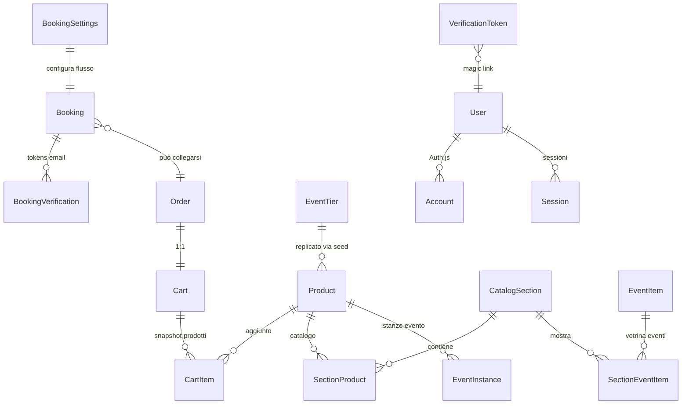
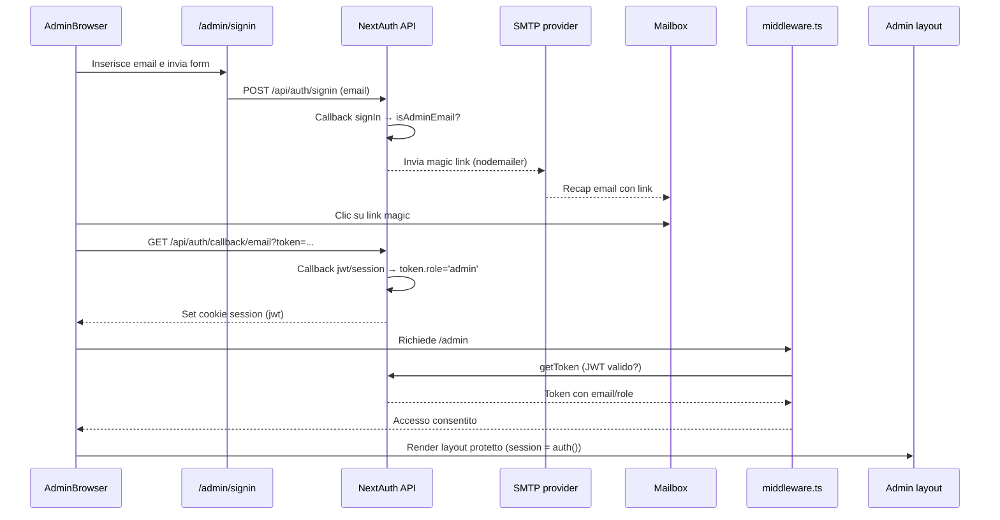

---
merged_from:
  - docs/AUDIT_BACKEND.md
  - docs/DATABASE.md
  - docs/API_CART.md
  - docs/AUTH.md
  - docs/EMAIL.md
  - docs/EVENTS_PUBLIC_API.md
updated: 2025-02-14
---
# Backend, API & Data Layer

> Questo documento sostituisce i file: `docs/AUDIT_BACKEND.md`, `docs/DATABASE.md`, `docs/API_CART.md`, `docs/AUTH.md`, `docs/EMAIL.md`, `docs/EVENTS_PUBLIC_API.md`. Riunisce panoramica architetturale, API, autenticazione, database e notifiche.

## Audit 2025 – stato attuale del backend
## Executive summary
* Backend Next.js App Router con API server-side e Prisma su SQLite: modelli `Booking`, `Product`, `CatalogSection`, `EventInstance`, carrello e Auth.js centralizzano prenotazioni, catalogo e accessi.【F:prisma/schema.prisma†L1-L304】
* Middleware e helper `assertAdmin` vincolano tutte le rotte `/admin` alla whitelist di email gestita via env, garantendo isolamento dell’area riservata.【F:src/middleware.ts†L13-L58】【F:src/lib/admin/session.ts†L1-L23】
* La configurazione prenotazioni è normalizzata da `getBookingSettings`, riusata sia dal frontend pubblico (`/api/booking-config`) sia dagli strumenti admin, riducendo incoerenze tra flussi.【F:src/lib/bookingSettings.ts†L1-L104】【F:src/app/api/booking-config/route.ts†L14-L68】
* Il dominio ordini integra Revolut e mailer centralizzati, con funzioni idempotenti (`createOrderFromCart`, `finalizePaidOrder`) per carrelli e pagamenti.【F:src/lib/orders.ts†L154-L323】【F:src/app/api/payments/checkout/route.ts†L18-L140】
* Criticità principale: l’elenco "Eventi – prenotazione via email" in admin resta vuoto perché `fetchAdminEventInstances` interroga `EventInstance` ma non esiste seed né CRUD per popolarla (solo PATCH su record esistenti).【F:src/lib/admin/event-instances.ts†L5-L26】【F:src/components/admin/settings/SettingsForm.tsx†L392-L458】【F:prisma/seed.ts†L401-L411】【F:src/app/api/admin/event-instances/[id]/route.ts†L20-L63】
* Mancano API REST per creare/listare EventInstance, perciò il flusso email-only dipende da inserimenti manuali in DB non coperti da documentazione o UI.【F:src/app/api/admin/event-instances/[id]/route.ts†L20-L63】【F:docs/_archive/EMAIL_ONLY_BOOKING_TEST.md†L21-L85】
* Logging distribuito fra `logger.info/warn/error` e `console.*` fornisce visibilità minima ma frammentata; non c’è osservabilità centralizzata o tracing.【F:src/lib/logger.ts†L1-L49】【F:src/app/api/bookings/email-only/route.ts†L102-L127】

## Stato attuale del backend a colpo d’occhio
* **Stack**: Next.js App Router con rotte server in `src/app/api`, middleware di sessione via Auth.js e Prisma Client condiviso, database SQLite configurato in `schema.prisma`.【F:src/app/api/bookings/route.ts†L1-L191】【F:src/middleware.ts†L13-L58】【F:prisma/schema.prisma†L1-L208】
* **Autenticazione**: provider email magic link (`next-auth` + PrismaAdapter), secret ed SMTP obbligatori, ruoli limitati a `admin` e whitelist `ADMIN_EMAILS` per accesso admin.【F:src/lib/auth.ts†L13-L91】【F:src/lib/admin/emails.ts†L1-L28】【F:src/middleware.ts†L33-L52】
* **Prenotazioni**: logica centralizzata in `bookingSettings`, `lunchOrder`, `bookingVerification`; API pubbliche gestiscono creazione, prepay, conferma token e flusso email-only.【F:src/lib/bookingSettings.ts†L1-L104】【F:src/lib/lunchOrder.ts†L1-L200】【F:src/app/api/bookings/email-only/route.ts†L1-L129】
* **Catalogo/Carrello**: nuovi modelli `Product`, `CatalogSection`, `SectionProduct`, `Cart`, `CartItem`, `Order`; API `/api/catalog`, `/api/cart`, `/api/orders` orchestrano browsing, checkout e pagamento (Revolut).【F:prisma/schema.prisma†L47-L191】【F:src/app/api/catalog/route.ts†L9-L100】【F:src/app/api/cart/route.ts†L1-L41】【F:src/app/api/orders/route.ts†L1-L31】
* **Area admin**: pagine server component + client component (toast) per prenotazioni, piatti legacy, tiers, catalogo, impostazioni; tutte richiedono sessione admin e usano fetch verso API interne o Prisma diretto.【F:src/app/admin/layout.tsx†L9-L53】【F:src/app/admin/bookings/page.tsx†L1-L8】【F:src/app/admin/catalog/sections/page.tsx†L1-L54】【F:src/app/admin/settings/page.tsx†L1-L12】
* **Mailer**: wrapper Nodemailer con caching, template HTML/ testo manuali per notifiche booking e ordine, usa env `SMTP_*`, `MAIL_FROM`, `MAIL_TO_BOOKINGS` per routing.【F:src/lib/mailer.ts†L5-L191】
* **Payments**: modulo Revolut gestisce ordini hosted, meta encoded in `paymentRef`, polling stato tramite `pollOrderStatus` che richiama API remote e finalizza ordini.【F:src/lib/revolut.ts†L1-L120】【F:src/lib/orders.ts†L219-L361】【F:src/app/api/payments/order-status/route.ts†L7-L51】

## Mappa delle rotte API
| Metodo | Path | Ambito | Handler (file) | Modelli Prisma toccati | Uso Auth/Middleware | Note |
| --- | --- | --- | --- | --- | --- | --- |
| GET/POST | /api/auth/[...nextauth] | pubblico | `auth/[...nextauth]/route.ts`【F:src/app/api/auth/[...nextauth]/route.ts†L1-L11】 | User, Account, Session (via Auth.js) | Middleware include `/api/auth`, gestione interna NextAuth | Endpoint standard NextAuth per sign-in magic link. |
| GET | /api/booking-config | pubblico | `booking-config/route.ts`【F:src/app/api/booking-config/route.ts†L14-L68】 | BookingSettings, MenuDish, EventTier | Nessun auth; lettura pubblica | Ritorna DTO con menu, cover e tiers attivi. |
| POST | /api/bookings | pubblico | `bookings/route.ts`【F:src/app/api/bookings/route.ts†L14-L191】 | Booking, EventTier | Nessun auth; validazione Zod | Crea prenotazioni confermate, invia email, valida tier e menu. |
| POST | /api/bookings/prepay | pubblico | `bookings/prepay/route.ts`【F:src/app/api/bookings/prepay/route.ts†L13-L166】 | Booking, EventTier | Nessun auth | Flusso pending con `prepayToken` e ordine fittizio. |
| POST | /api/bookings/email-only | pubblico | `bookings/email-only/route.ts`【F:src/app/api/bookings/email-only/route.ts†L30-L129】 | EventInstance, Booking, Product, BookingVerification | Nessun auth; usa rate log | Richiede `allowEmailOnlyBooking`, crea booking pending e token email. |
| GET | /api/bookings/confirm | pubblico | `bookings/confirm/route.ts`【F:src/app/api/bookings/confirm/route.ts†L1-L15】 | — | Nessun auth | Deprecato, risponde `410` e invita a usare `/api/payments/email-verify`. |
| POST | /api/bookings/resend-confirmation | pubblico | `bookings/resend-confirmation/route.ts`【F:src/app/api/bookings/resend-confirmation/route.ts†L13-L137】 | Booking, BookingVerification | Nessun auth; rate-limit via `assertCooldownOrThrow` | Rigenera token per pending con rate limiting per email/IP. |
| POST | /api/bookings/fake-confirm | pubblico (dev) | `bookings/fake-confirm/route.ts`【F:src/app/api/bookings/fake-confirm/route.ts†L15-L95】 | Booking | Nessun auth; usa mailer | Simula conferma pagamento anticipato (sandbox). |
| POST | /api/bookings/fake-cancel | pubblico (dev) | `bookings/fake-cancel/route.ts`【F:src/app/api/bookings/fake-cancel/route.ts†L13-L44】 | Booking | Nessun auth | Simula annullo di pagamento anticipato. |
| GET/POST | /api/cart | pubblico | `cart/route.ts`【F:src/app/api/cart/route.ts†L1-L41】 | Cart, CartItem | Nessun auth | Crea/recupera carrelli associati a cookie `cart_token`. |
| GET/PATCH | /api/cart/[id] | pubblico | `cart/[id]/route.ts`【F:src/app/api/cart/[id]/route.ts†L13-L40】 | Cart, CartItem | Nessun auth | Lettura e ricalcolo totale carrello. |
| GET | /api/catalog | pubblico | `catalog/route.ts`【F:src/app/api/catalog/route.ts†L9-L100】 | CatalogSection, SectionProduct, Product | Nessun auth | Aggrega sezioni attive con prodotti disponibili. |
| POST | /api/newsletter | pubblico | `newsletter/route.ts`【F:src/app/api/newsletter/route.ts†L1-L11】 | (nessun modello) | Nessun auth | Riceve form email (TODO double opt-in). |
| POST | /api/orders | pubblico | `orders/route.ts`【F:src/app/api/orders/route.ts†L1-L31】 | Cart, Order, Booking (via `createOrderFromCart`) | Nessun auth | Valida carrello e avvia workflow ordine. |
| POST | /api/orders/finalize | pubblico | `orders/finalize/route.ts`【F:src/app/api/orders/finalize/route.ts†L8-L18】 | Order, Booking, Cart | Nessun auth | Finalizza ordine già pagato. |
| POST | /api/payments/checkout | pubblico | `payments/checkout/route.ts`【F:src/app/api/payments/checkout/route.ts†L12-L140】 | Order, Cart | Nessun auth | Crea ordine Revolut o finalizza free, invia mail pagamento. |
| GET/POST | /api/payments/order-status | pubblico | `payments/order-status/route.ts`【F:src/app/api/payments/order-status/route.ts†L7-L53】 | Order | Nessun auth | Polling stato ordine via DB + Revolut. |
| GET | /api/admin/_whoami | admin | `admin/_whoami/route.ts`【F:src/app/api/admin/_whoami/route.ts†L6-L32】 | (nessun modello) | Middleware + NextAuth token | Debug sessione dev con env summary. |
| GET | /api/admin/bookings | admin | `admin/bookings/route.ts`【F:src/app/api/admin/bookings/route.ts†L12-L42】 | Booking | `assertAdmin` | Lista paginata prenotazioni con filtri. |
| GET | /api/admin/contacts | admin | `admin/contacts/route.ts`【F:src/app/api/admin/contacts/route.ts†L4-L41】 | Booking | `assertAdmin` (401 se non admin) | Contatti deduplicati per email con paginazione (`page` ≥1, `pageSize` ≤100), filtro `q` su nome/email/telefono e ordine `createdAt DESC`; risposta `{ items, page, pageSize, total, totalPages }`.【F:src/lib/admin/contacts-query.ts†L5-L182】 |
| PATCH/DELETE | /api/admin/bookings/[id] | admin | `admin/bookings/[id]/route.ts`【F:src/app/api/admin/bookings/[id]/route.ts†L41-L120】 | Booking, BookingSettings | `assertAdmin` | Update/soft delete booking, valida tipi e date. |
| POST | /api/admin/bookings/[id]/confirm | admin | `admin/bookings/[id]/confirm/route.ts`【F:src/app/api/admin/bookings/[id]/confirm/route.ts†L18-L62】 | Booking | `assertAdmin` | Imposta stato `confirmed` e reinvia email. |
| POST | /api/admin/bookings/[id]/cancel | admin | `admin/bookings/[id]/cancel/route.ts`【F:src/app/api/admin/bookings/[id]/cancel/route.ts†L15-L41】 | Booking | `assertAdmin` | Marca `cancelled` e invia email testo (se SMTP). |
| POST | /api/admin/bookings/[id]/resend | admin | `admin/bookings/[id]/resend/route.ts`【F:src/app/api/admin/bookings/[id]/resend/route.ts†L18-L58】 | Booking | `assertAdmin` | Reinvio conferma manuale (usa storicizzazione ordini). |
| GET/POST | /api/admin/tiers | admin | `admin/tiers/route.ts`【F:src/app/api/admin/tiers/route.ts†L43-L133】 | EventTier | `assertAdmin` | CRUD paginato pacchetti evento/aperitivo. |
| PATCH/DELETE | /api/admin/tiers/[id] | admin | `admin/tiers/[id]/route.ts`【F:src/app/api/admin/tiers/[id]/route.ts†L24-L73】 | EventTier | `assertAdmin` | Aggiorna/soft delete tier. |
| GET/POST | /api/admin/menu/dishes | admin | `admin/menu/dishes/route.ts`【F:src/app/api/admin/menu/dishes/route.ts†L43-L157】 | MenuDish | `assertAdmin` | Legacy CRUD piatti pranzo con filtri. |
| PATCH/DELETE | /api/admin/menu/dishes/[id] | admin | `admin/menu/dishes/[id]/route.ts`【F:src/app/api/admin/menu/dishes/[id]/route.ts†L34-L109】 | MenuDish | `assertAdmin` | Aggiorna slug, stato e visibilità; soft/hard delete. |
| PATCH | /api/admin/event-instances/[id] | admin | `admin/event-instances/[id]/route.ts`【F:src/app/api/admin/event-instances/[id]/route.ts†L20-L63】 | EventInstance | `assertAdmin` | Unico endpoint: toggle `allowEmailOnlyBooking`. Nessun GET/POST. |
| GET/POST | /api/admin/products | admin | `admin/products/route.ts`【F:src/app/api/admin/products/route.ts†L42-L140】 | Product | `assertAdmin` | CRUD catalogo prodotti unificato. |
| PATCH/DELETE | /api/admin/products/[id] | admin | `admin/products/[id]/route.ts`【F:src/app/api/admin/products/[id]/route.ts†L33-L135】 | Product | `assertAdmin` | Update selettivo e soft delete con controllo slug. |
| GET/POST | /api/admin/sections | admin | `admin/sections/route.ts`【F:src/app/api/admin/sections/route.ts†L10-L55】 | CatalogSection | `assertAdmin` | Lista e upsert sezioni catalogo. |
| POST/DELETE | /api/admin/sections/[sectionId]/products | admin | `admin/sections/[sectionId]/products/route.ts`【F:src/app/api/admin/sections/[sectionId]/products/route.ts†L13-L88】 | SectionProduct, CatalogSection, Product | `assertAdmin` | Assegna/rimuove prodotti alle sezioni. |
| GET/PUT/PATCH | /api/admin/settings | admin | `admin/settings/route.ts`【F:src/app/api/admin/settings/route.ts†L52-L178】 | BookingSettings | `assertAdmin` | Lettura/aggiornamento impostazioni prenotazioni. |

## Albero sorgenti rilevante (code-map)
### src/app/api
- `booking-config/route.ts` — DTO pubblico che aggrega impostazioni, piatti attivi e tier evento.【F:src/app/api/booking-config/route.ts†L14-L68】
- `bookings/route.ts` — Endpoint principale creazione prenotazioni con validazioni tier/menu.【F:src/app/api/bookings/route.ts†L14-L191】
- `bookings/prepay/route.ts` — Variante pending con token per pagamento anticipato.【F:src/app/api/bookings/prepay/route.ts†L13-L166】
- `bookings/email-only/route.ts` — Flusso eventi senza pagamento basato su `EventInstance` e token email.【F:src/app/api/bookings/email-only/route.ts†L30-L129】
- `bookings/confirm|resend|fake-*` — Conferma token legacy (ora deprecata), resend rate-limited e simulazioni sandbox.【F:src/app/api/bookings/confirm/route.ts†L1-L15】【F:src/app/api/bookings/resend-confirmation/route.ts†L39-L137】【F:src/app/api/bookings/fake-confirm/route.ts†L15-L95】
- `cart/route.ts` & `[id]/route.ts` — Gestione carrello (creazione, ricalcolo totale).【F:src/app/api/cart/route.ts†L1-L41】【F:src/app/api/cart/[id]/route.ts†L13-L40】
- `catalog/route.ts` — Costruzione vetrina sezioni e prodotti attivi.【F:src/app/api/catalog/route.ts†L9-L100】
- `newsletter/route.ts` — Stub raccolta email con TODO double opt-in.【F:src/app/api/newsletter/route.ts†L1-L11】
- `orders/route.ts` & `orders/finalize/route.ts` — Creazione e finalizzazione ordini con fallback idempotente.【F:src/app/api/orders/route.ts†L8-L31】【F:src/app/api/orders/finalize/route.ts†L8-L18】
- `payments/checkout|order-status` — Integrazione Revolut e polling stato pagamenti.【F:src/app/api/payments/checkout/route.ts†L18-L140】【F:src/app/api/payments/order-status/route.ts†L7-L51】
- `auth/[...nextauth]/route.ts` — Esporta handler GET/POST NextAuth.【F:src/app/api/auth/[...nextauth]/route.ts†L1-L11】
- `admin/_whoami/route.ts` — Endpoint diagnostico sessione admin in dev.【F:src/app/api/admin/_whoami/route.ts†L6-L32】
- `admin/bookings/*` — Liste, update, conferma/cancel/resend prenotazioni.【F:src/app/api/admin/bookings/route.ts†L12-L42】【F:src/app/api/admin/bookings/[id]/confirm/route.ts†L18-L62】
- `admin/tiers/*` — CRUD pacchetti evento/aperitivo.【F:src/app/api/admin/tiers/route.ts†L43-L133】【F:src/app/api/admin/tiers/[id]/route.ts†L24-L82】
- `admin/menu/dishes/*` — CRUD piatti legacy con slug auto.【F:src/app/api/admin/menu/dishes/route.ts†L43-L157】【F:src/app/api/admin/menu/dishes/[id]/route.ts†L34-L115】
- `admin/event-instances/[id]/route.ts` — Solo PATCH su `allowEmailOnlyBooking` per istanza evento.【F:src/app/api/admin/event-instances/[id]/route.ts†L20-L63】
- `admin/products/*` — CRUD catalogo prodotti riusabili.【F:src/app/api/admin/products/route.ts†L42-L140】【F:src/app/api/admin/products/[id]/route.ts†L33-L135】
- `admin/sections/*` — Upsert sezioni e associazioni prodotti.【F:src/app/api/admin/sections/route.ts†L10-L55】【F:src/app/api/admin/sections/[sectionId]/products/route.ts†L13-L88】
- `admin/settings/route.ts` — Gestione BookingSettings (PUT/PATCH).【F:src/app/api/admin/settings/route.ts†L52-L178】

### src/components/admin
- `AdminNav.tsx` — Navigazione laterale con sezioni legacy/catalogo e sign-out.【F:src/components/admin/AdminNav.tsx†L60-L138】
- `AdminProviders.tsx` — Wrapper client SessionProvider per area admin.【F:src/components/admin/AdminProviders.tsx†L7-L13】
- `EmailSignInForm.tsx` — Form magic link (non mostrato, ma usato da `/admin/signin`).【F:src/app/admin/signin/page.tsx†L4-L43】
- `bookings/BookingsView.tsx` — Client component con filtri, azioni confirm/cancel/resend, stampa.【F:src/components/admin/bookings/BookingsView.tsx†L8-L180】
- `bookings/PrintTrigger.tsx` — Bottone stampa collegato a pagina print.【F:src/app/admin/bookings/print/page.tsx†L6-L47】
- `menu/MenuDishesManager.tsx` — Gestione CRUD piatti legacy con toast e modale editing.【F:src/components/admin/menu/MenuDishesManager.tsx†L1-L180】
- `tiers/TiersManager.tsx` — Gestione pacchetti evento/aperitivo con creazione, draft e toggle attivo.【F:src/components/admin/tiers/TiersManager.tsx†L1-L200】
- `catalog/ProductForm.tsx` & `CatalogProductsPageClient` — Form admin prodotti con toast e validazioni slug/prezzo.【F:src/components/admin/catalog/ProductForm.tsx†L1-L120】
- `catalog/SectionsPageClient.tsx` — UI assegnazione prodotti alle sezioni, toggle attivo/enableDateTime.【F:src/components/admin/catalog/SectionsPageClient.tsx†L1-L160】
- `settings/SettingsForm.tsx` — Gestione impostazioni prenotazioni e lista eventi email-only con toggle PATCH.【F:src/components/admin/settings/SettingsForm.tsx†L20-L458】
- `ui/toast.tsx` — Provider toast riusato nei client component.【F:src/components/admin/ui/toast.tsx†L1-L120】

### src/lib (API/Admin)
- `admin/event-instances.ts` — Fetch server-side istanze evento ordinate per startAt.【F:src/lib/admin/event-instances.ts†L5-L25】
- `admin/booking-query.ts` — Costruzione filtri bookings admin (pagina, date, status).【F:src/lib/admin/booking-query.ts†L1-L48】
- `admin/booking-dto.ts` — Mappatura Booking → DTO amministrativo.【F:src/lib/admin/booking-dto.ts†L1-L120】
- `admin/settings-dto.ts` — Normalizza BookingSettings per UI admin.【F:src/lib/admin/settings-dto.ts†L5-L24】
- `admin/session.ts` — Helper `assertAdmin` su base NextAuth + whitelist.【F:src/lib/admin/session.ts†L7-L23】
- `admin/emails.ts` — Parsing e cache di `ADMIN_EMAILS`.【F:src/lib/admin/emails.ts†L6-L28】
- `auth.ts` — Config NextAuth email provider con env obbligatorie.【F:src/lib/auth.ts†L13-L91】
- `bookingSettings.ts` — Lettura, default e conversione DTO prenotazioni.【F:src/lib/bookingSettings.ts†L1-L104】
- `bookingVerification.ts` — Emissione/consumo token conferma (usato da API email-only).【F:src/lib/bookingVerification.ts†L1-L160】
- `cart.ts` — Helper per carrelli e calcolo totale, usati da API e orders.【F:src/lib/cart.ts†L1-L90】
- `orders.ts` — Workflow ordini, integrazione mail e booking linking.【F:src/lib/orders.ts†L154-L361】
- `revolut.ts` — Client API Revolut Orders con gestione env e hosted URLs.【F:src/lib/revolut.ts†L17-L120】
- `paymentRef.ts` — Encoding/decoding metadati provider nei campi stringa.【F:src/lib/paymentRef.ts†L1-L160】
- `mailer.ts` — Factory transport SMTP e template email booking/order.【F:src/lib/mailer.ts†L5-L191】
- `logger.ts` — Logger JSON minimale con masking email.【F:src/lib/logger.ts†L1-L49】
- `rateLimit.ts` — Cooldown in-memory per resend prenotazioni.【F:src/lib/rateLimit.ts†L1-L27】
- `prisma.ts` — Singleton Prisma con log in dev.【F:src/lib/prisma.ts†L1-L11】

### prisma
- `schema.prisma` — Definisce datasource SQLite e tutti i modelli (Booking, Product, EventInstance, Cart, Auth).【F:prisma/schema.prisma†L1-L304】
- `migrations/*/migration.sql` — Serie di step: init booking, BookingSettings, Auth tables, catalog/carrello, verifiche email, ecc. (vedi tabella migrazioni).【F:prisma/migrations/20251005_cart_schema/migration.sql†L1-L130】【F:prisma/migrations/20251009092233_add_booking_verification/migration.sql†L1-L47】
- `seed.ts` — Seed catalogo, admin users, settings; nessun inserimento EventInstance.【F:prisma/seed.ts†L15-L111】【F:prisma/seed.ts†L401-L411】

## Modelli & Migrazioni (Prisma)
### Modelli chiave
- **Booking** — Gestisce prenotazioni con tipi (`BookingType`), stato (`BookingStatus`), JSON ordini pranzo/cena, collegamento opzionale a `Order` e verifiche.【F:prisma/schema.prisma†L11-L45】
- **BookingVerification** — Token email per conferma, indici su scadenza e booking; supporta email-only flow.【F:prisma/schema.prisma†L123-L137】
- **Order / Cart / CartItem** — Workflow acquisti: carrello con snapshot articoli, ordine con `paymentRef`, note e relazione 1-1 al carrello.【F:prisma/schema.prisma†L139-L191】
- **Product / CatalogSection / SectionProduct** — Catalogo riusabile per sezioni (eventi, pranzo, ecc.) con pivot e flag visibilità.【F:prisma/schema.prisma†L47-L103】
- **EventInstance** — Istanze eventi con `allowEmailOnlyBooking` boolean e indice per prodotto/data; usate solo da email-only toggle.【F:prisma/schema.prisma†L105-L121】
- **BookingSettings** — Configurazioni globali: tipi abilitati, coperti, flag prepay pranzo/cena, JSON label.【F:prisma/schema.prisma†L193-L207】
- **EventTier** — Listino prezzi evento/aperitivo con timestamp e indice su tipo+ordine.【F:prisma/schema.prisma†L240-L252】
- **MenuDish** — Legacy menu pranzo/cena con `visibleAt`.【F:prisma/schema.prisma†L226-L238】
- **User/Account/Session** — Tabelle Auth.js per login email con ruolo admin di default.【F:prisma/schema.prisma†L254-L292】
- **VerificationToken** — Token magic link Auth.js (separato da BookingVerification).【F:prisma/schema.prisma†L294-L300】

### Tabella Migrazioni
| ID cartella | Sintesi schema | Citazioni |
| --- | --- | --- |
| 20251001150916_init | Crea tabella `Booking` base con status default `pending`. | 【F:prisma/migrations/20251001150916_init/migration.sql†L1-L12】 |
| 20251002071639_add_type_and_flags | Aggiunge campi `type`, consensi marketing/privacy su Booking. | 【F:prisma/migrations/20251002071639_add_type_and_flags/migration.sql†L8-L26】 |
| 20251002133537_booking_settings | Introduce tabella `BookingSettings` e rende `phone` obbligatorio. | 【F:prisma/migrations/20251002133537_booking_settings/migration.sql†L7-L66】 |
| 20251002160000_admin_auth | Aggiunge tabelle Auth.js (`User`, `Account`, `Session`, `VerificationToken`). | 【F:prisma/migrations/20251002160000_admin_auth/migration.sql†L1-L97】 |
| 20251003051448_admin_auth | Converte campi BookingSettings JSON → JSONB. | 【F:prisma/migrations/20251003051448_admin_auth/migration.sql†L9-L26】 |
| 20251004120000_lunch_menu | Estende Booking con campi pranzo e crea `MenuDish`; aggiunge cover/prenotazione pranzo. | 【F:prisma/migrations/20251004120000_lunch_menu/migration.sql†L1-L45】 |
| 20251004145500_dinner_prepay_and_visible_at | Aggiunge `dinnerRequirePrepay` e `MenuDish.visibleAt`. | 【F:prisma/migrations/20251004145500_dinner_prepay_and_visible_at/migration.sql†L1-L9】 |
| 20251004180020_add_eventtier_timestamps | Introduce `EventTier` e campi cena/tier su Booking/Settings. | 【F:prisma/migrations/20251004180020_add_eventtier_timestamps/migration.sql†L1-L48】 |
| 20251004193000_add_cena_booking_type | Aggiornamento enum BookingType per includere `cena`. | 【F:prisma/migrations/20251004193000_add_cena_booking_type/migration.sql†L1-L1】 |
| 20251005_cart_schema | Crea schema catalogo/carrello (`Product`, `CatalogSection`, `EventInstance`, `Cart`, `Order`). | 【F:prisma/migrations/20251005_cart_schema/migration.sql†L1-L130】 |
| 20251006070421_cart_relations | Aggiunge foreign key cart item e indici prodotti. | 【F:prisma/migrations/20251006070421_cart_relations/migration.sql†L1-L33】 |
| 20251008065557_add_notes_to_order | Aggiunge `notes` ordine e FK Booking→Order, richiede phone. | 【F:prisma/migrations/20251008065557_add_notes_to_order/migration.sql†L7-L64】 |
| 20251008083409_add_notes_to_order | Rimuove `providerRef`, mantiene `notes` su Order e indice `paymentRef`. | 【F:prisma/migrations/20251008083409_add_notes_to_order/migration.sql†L7-L31】 |
| 20251009092233_add_booking_verification | Crea `BookingVerification` e aggiunge `allowEmailOnlyBooking` su EventInstance. | 【F:prisma/migrations/20251009092233_add_booking_verification/migration.sql†L1-L47】 |

## Admin UI – Pagine & Loader
| Pagina admin | Componente principale | Data source | Azioni/Note |
| --- | --- | --- | --- |
| `/admin` | `src/app/admin/page.tsx` → dashboard Prisma (conteggi, liste) | Query dirette `prisma.booking` (conteggi, upcoming, latest).【F:src/app/admin/page.tsx†L20-L87】 | Solo lettura, link rapido prenotazioni. |
| `/admin/bookings` | `BookingsView` client con toast.【F:src/app/admin/bookings/page.tsx†L1-L8】【F:src/components/admin/bookings/BookingsView.tsx†L25-L180】 | Fetch `/api/admin/bookings` con filtri, azioni su sub-API confirm/cancel/resend. | Filtri search/type/status/date, toast success/error, stampa. |
| `/admin/contacts` | `ContactsPageClient` client + ToastProvider.【F:src/app/admin/(protected)/contacts/page.tsx†L1-L9】【F:src/components/admin/contacts/ContactsPageClient.tsx†L1-L312】 | Fetch `/api/admin/contacts` con DTO `{ items, page, pageSize, total, totalPages }` + query `q`, `newsletter`, `privacy`, `from`, `to`. | Deduplica per email, badge consensi e navigazione paginata lato client. |
| `/admin/bookings/print` | Pagina server stampa elenco corrente.【F:src/app/admin/bookings/print/page.tsx†L6-L96】 | `buildAdminBookingQuery` + Prisma (select campi ridotti). | Layout print-friendly, bottone PrintTrigger. |
| `/admin/menu/dishes` | `MenuDishesManager` client.【F:src/app/admin/menu/dishes/page.tsx†L8-L44】【F:src/components/admin/menu/MenuDishesManager.tsx†L1-L120】 | Fetch `/api/admin/menu/dishes` (paginato) + azioni POST/PATCH/DELETE. | Toast per creazione/update; filtri attivo/categoria/search. |
| `/admin/tiers` | `TiersManager` client.【F:src/app/admin/tiers/page.tsx†L18-L40】【F:src/components/admin/tiers/TiersManager.tsx†L54-L138】 | Fetch iniziale `/api/admin/tiers`, poi load dinamico, POST/PATCH/DELETE. | Crea/ordina/attiva tiers, toast esito. |
| `/admin/catalog/products` | `CatalogProductsPageClient` (ProductForm).【F:src/app/admin/catalog/products/page.tsx†L4-L8】【F:src/components/admin/catalog/ProductForm.tsx†L1-L112】 | Client component invoca `/api/admin/products` per CRUD. | Form completo con flag nutrizionali, slug auto, toast. |
| `/admin/catalog/sections` | `SectionsPageClient` con Toast.【F:src/app/admin/catalog/sections/page.tsx†L1-L54】【F:src/components/admin/catalog/SectionsPageClient.tsx†L1-L160】 | Prisma server (sections + product map), poi fetch `/api/admin/sections` e `/api/admin/sections/[sectionId]/products`. | Toggle attivo/dateTime, assegnazione prodotti con ordine/featured/home. |
| `/admin/settings` | `SettingsForm` client.【F:src/app/admin/settings/page.tsx†L8-L12】【F:src/components/admin/settings/SettingsForm.tsx†L20-L188】 | Server side `fetchAdminSettingsDTO` + `fetchAdminEventInstances`; azioni `PUT/PATCH /api/admin/settings` e `PATCH /api/admin/event-instances/{id}`. | Gestisce tipi attivi, prepay, coperti e toggles evento email-only con toast. |
| `/admin/signin` | Form accesso email magic link.【F:src/app/admin/signin/page.tsx†L4-L43】 | NextAuth signIn, nessun fetch addizionale. | Mostra errori AccessDenied. |
| `/admin/not-authorized` | Pagina fallback (static).【F:src/app/admin/not-authorized/page.tsx†L1-L20】 | N/A | Messaggio accesso negato. |

### Sezione focus: /admin/settings
- `src/app/admin/settings/page.tsx` carica impostazioni e lista eventi via Prisma server utilities.【F:src/app/admin/settings/page.tsx†L8-L12】
- Query istanze evento:
  ```ts
  // src/lib/admin/event-instances.ts
  export async function fetchAdminEventInstances(): Promise<AdminEventInstance[]> {
    const instances = await prisma.eventInstance.findMany({
      orderBy: { startAt: 'asc' },
      select: { id: true, title: true, slug: true, startAt: true, allowEmailOnlyBooking: true, active: true },
    });
    return instances.map((instance) => ({
      id: instance.id,
      title: instance.title,
      slug: instance.slug,
      startAt: instance.startAt.toISOString(),
      allowEmailOnlyBooking: instance.allowEmailOnlyBooking,
      active: instance.active,
    }));
  }
  ```
  【F:src/lib/admin/event-instances.ts†L5-L25】
- Nel form, l’elenco mostra "Nessuna istanza evento disponibile" quando l’array è vuoto e i toggle PATCH chiamano `/api/admin/event-instances/{id}`.【F:src/components/admin/settings/SettingsForm.tsx†L392-L458】

## Analisi: perché la lista “Eventi – prenotazione via email” è vuota
- La UI legge le istanze tramite `fetchAdminEventInstances`, che restituisce solo dati presenti in tabella `EventInstance`; l’array è passato direttamente al client senza altre trasformazioni.【F:src/lib/admin/event-instances.ts†L5-L25】【F:src/app/admin/settings/page.tsx†L8-L12】
- Il seed ufficiale popola sezioni, piatti, tiers e utenti admin ma non crea alcuna riga in `EventInstance`, lasciando il dataset vuoto su ambienti nuovi.【F:prisma/seed.ts†L15-L111】【F:prisma/seed.ts†L401-L411】
- Non esistono API o componenti admin per creare/listare EventInstance: l’unica rotta disponibile è il PATCH su `/api/admin/event-instances/{id}` per aggiornare `allowEmailOnlyBooking`, quindi l’interfaccia non può generare nuovi eventi né mostrarli se assenti.【F:src/app/api/admin/event-instances/[id]/route.ts†L20-L63】
- La documentazione interna assume la presenza di eventi e del relativo toggle in admin, ma senza CRUD o seed non viene mai popolato l’elenco.【F:docs/_archive/EMAIL_ONLY_BOOKING_TEST.md†L21-L35】【F:src/components/admin/settings/SettingsForm.tsx†L392-L458】

**Conclusione:** la lista è vuota perché il database non contiene record `EventInstance` preesistenti e il backend espone solo un PATCH su istanze già create. Senza seed manuale o altra UI/rotta di creazione, il client riceve sempre un array vuoto e mostra il messaggio di assenza.【F:src/lib/admin/event-instances.ts†L5-L25】【F:prisma/seed.ts†L401-L411】【F:src/components/admin/settings/SettingsForm.tsx†L392-L458】

**Come verificare manualmente**
1. Accedi all’area admin, apri `/admin/settings` e verifica la sezione "Eventi – prenotazione via email" che riporta "Nessuna istanza evento disponibile".【F:src/components/admin/settings/SettingsForm.tsx†L392-L399】
2. Con la sessione admin attiva, richiama `GET /api/admin/settings` (ad esempio via `curl` con cookie sessione) per confermare che la risposta contiene solo il DTO delle impostazioni senza elenco eventi.【F:src/app/api/admin/settings/route.ts†L52-L125】
3. Interroga `GET /api/booking-config` per verificare che le configurazioni includano tiers evento ma nessuna istanza specifica, evidenziando la mancanza di EventInstance nei dati esposti.【F:src/app/api/booking-config/route.ts†L14-L68】
4. Tentare un `PATCH /api/admin/event-instances/{id}` con un ID ipotetico restituisce 404 (`Evento non trovato`), confermando l’assenza di record da aggiornare.【F:src/app/api/admin/event-instances/[id]/route.ts†L46-L60】

## Dipendenze & Config
- **Mailer**: `src/lib/mailer.ts` usa Nodemailer; richiede `SMTP_HOST`, `SMTP_PORT`, `SMTP_USER`, `SMTP_PASS`, `MAIL_FROM`, opzionale `MAIL_TO_BOOKINGS`. Templates custom per richieste, conferme e notifiche admin.【F:src/lib/mailer.ts†L5-L191】
- **Auth.js**: Configurazione in `src/lib/auth.ts`, legge `NEXTAUTH_SECRET`, `NEXTAUTH_URL`, `MAIL_FROM`, `SMTP_HOST`, `SMTP_PORT`, `SMTP_USER`, `SMTP_PASS`; fallisce al boot se mancanti.【F:src/lib/auth.ts†L13-L91】
- **Payments (Revolut)**: `src/lib/revolut.ts` richiede `REVOLUT_SECRET_KEY`, `REVOLUT_API_VERSION`, `REVOLUT_ENV`/`NEXT_PUBLIC_REVOLUT_ENV`, opzionale `REVOLUT_API_BASE`; `payments/checkout` usa inoltre `NEXT_PUBLIC_BASE_URL`, `NEXT_PUBLIC_REVOLUT_PUBLIC_KEY`, `PAY_RETURN_URL`, `PAY_CANCEL_URL`.【F:src/lib/revolut.ts†L33-L75】【F:src/app/api/payments/checkout/route.ts†L12-L140】
- **Altre variabili backend** (letture dirette):
  - `APP_BASE_URL`, `NEXT_PUBLIC_BASE_URL`, `BASE_URL` (costruzione link conferma).【F:src/app/api/bookings/email-only/route.ts†L36-L43】【F:src/app/api/bookings/resend-confirmation/route.ts†L17-L23】
  - `MAIL_FROM`, `SMTP_HOST`, `SMTP_PORT` (diagnostica `_whoami`).【F:src/app/api/admin/_whoami/route.ts†L18-L26】
  - `ADMIN_EMAILS` (middleware, mailer admin).【F:src/middleware.ts†L41-L52】【F:src/lib/mailer.ts†L755-L767】
  - `NEXTAUTH_SECRET` (middleware e `_whoami`).【F:src/middleware.ts†L33-L38】【F:src/app/api/admin/_whoami/route.ts†L21-L22】
  - `NEXT_PUBLIC_CART_ENABLED`, `NEXT_PUBLIC_POLICY_VERSION`, `NEXT_PUBLIC_REVOLUT_PUBLIC_KEY`, `NEXT_PUBLIC_REVOLUT_ENV` (letti anche da componenti client, documentati per completezza).【F:src/app/prenota/page.tsx†L1-L12】【F:src/components/cookies/CookieBar.tsx†L7-L12】【F:src/components/cart/CheckoutButton.tsx†L26-L33】

## Osservabilità attuale
- Logger JSON centralizzato (`src/lib/logger.ts`) con masking email, usato nei flussi email-only, conferma e resend per tracciare outcome (ok, rate-limited, error).【F:src/lib/logger.ts†L1-L49】【F:src/app/api/bookings/email-only/route.ts†L102-L127】【F:src/app/api/bookings/resend-confirmation/route.ts†L52-L135】
- Ampio uso di `console.warn/error` nelle API (prenotazioni, pagamenti, cancellazioni) per segnalare errori Zod, assenza config SMTP, rate-limit, ecc.【F:src/app/api/bookings/route.ts†L21-L187】【F:src/app/api/payments/checkout/route.ts†L44-L143】【F:src/app/api/admin/bookings/[id]/cancel/route.ts†L32-L40】
- Non esistono integrazioni con sistemi di logging esterni, metrics o tracing; tutto il reporting è su stdout e in-memory rate limits.【F:src/lib/rateLimit.ts†L1-L27】

## Allineamento con la documentazione esistente
- Docs `ADMIN.md` elencano pagine legacy/nuove, coerenti con struttura effettiva (es. `/admin/catalog/products`, `/admin/catalog/sections`).【F:docs/_archive/ADMIN.md†L8-L27】【F:src/app/admin/catalog/products/page.tsx†L4-L8】
- `EMAIL_ONLY_BOOKING_TEST.md` presume esistenza di istanze evento gestibili da admin; il codice conferma toggle ma mancano seed/CRUD, quindi i test non possono passare senza dati manuali (disallineamento).【F:docs/_archive/EMAIL_ONLY_BOOKING_TEST.md†L21-L85】【F:src/components/admin/settings/SettingsForm.tsx†L392-L458】
- Documentazione cart (`AUDIT_CART.md`/`CART_SCHEMA_NOTES.md`) menziona catalogo unificato e carrello persistente, coerente con schema e API presenti.【F:docs/_archive/CART_SCHEMA_NOTES.md†L1-L6】【F:prisma/schema.prisma†L47-L191】【F:src/app/api/cart/route.ts†L1-L41】
- Nessun riferimento nei docs a limiti attuali su EventInstance o mancanza di API dedicate: gap da evidenziare nell’onboarding tecnico. |

## Appendice
### Glossario entità
- **Booking**: prenotazione cliente con eventuali ordini pranzo/cena e link a ordine pagamento.【F:prisma/schema.prisma†L11-L45】
- **EventInstance**: singola data/slot evento collegata a prodotto, con flag `allowEmailOnlyBooking` per flusso email-only.【F:prisma/schema.prisma†L105-L121】
- **BookingVerification**: token temporaneo per confermare prenotazioni pendenti via email.【F:prisma/schema.prisma†L123-L137】
- **EventTier**: pacchetto/prezzo evento o aperitivo selezionabile in prenotazione.【F:prisma/schema.prisma†L240-L252】
- **Product / CatalogSection / SectionProduct**: catalogo modulare per sezioni (eventi, pranzo, ecc.) e assegnazioni prodotti.【F:prisma/schema.prisma†L47-L103】
- **Cart / Order / CartItem**: pipeline e-commerce per acquisti/checkout collegati alle prenotazioni.【F:prisma/schema.prisma†L139-L191】

### Tabelle di riferimento
- **Rotte API**: vedere sezione "Mappa delle rotte API" per elenco completo di endpoint, modelli e auth.
- **Modelli/Migrazioni**: sezione "Modelli & Migrazioni" riassume schema corrente e step evolutivi.

### Indice dei file citati
- `src/app/api` (tutte le rotte elencate)
- `src/app/admin` (pagine dashboard, bookings, settings, catalog)
- `src/components/admin` (BookingsView, SettingsForm, MenuDishesManager, TiersManager, ProductForm, SectionsPageClient, AdminNav, AdminProviders, toast)
- `src/lib` (admin helpers, bookingSettings, cart, orders, revolut, mailer, logger, rateLimit, prisma)
- `prisma/schema.prisma`, `prisma/migrations/*`, `prisma/seed.ts`
- `docs/_archive/ADMIN.md`, `docs/_archive/EMAIL_ONLY_BOOKING_TEST.md`, `docs/_archive/CART_SCHEMA_NOTES.md`

## Database & Prisma

## Diagramma ER (schema corrente)


## Modelli chiave
- **Booking**: prenotazioni legacy e derivate dal checkout; snapshot ordine (`*_Json`, `tier*`), relazione opzionale con `Order`.
- **BookingVerification**: token email-only con `token @unique`, `nonce`, `expiresAt`, `usedAt`.
- **BookingSettings**: singola riga (`id=1`) con configurazione wizard (cover, tipi, prepagato).
- **Cart / CartItem**: carrello persistente via cookie; `Cart.status` (`open`, `locked`, ...), `CartItem` conserva snapshot prodotto.
- **Order**: 1:1 con `Cart` (`cartId @unique`), stato pagamento (`status` string), `paymentRef` (metadati Revolut), relazione inversa `Booking[]`.
- **CatalogSection / SectionProduct**: definiscono vetrine e ordering dei `Product` (chiave composta `sectionId_productId`).
- **EventInstance**: eventi programmati collegati ad un `Product` (usato per prezzi e copy). `allowEmailOnlyBooking` abilita flow senza pagamento.
- **EventItem / SectionEventItem**: futura vetrina eventi (seed/migrazione già predisposta).
- **MenuDish / EventTier**: entità legacy che alimentano prodotti e pacchetti via seed.
- **Auth.js (`User`, `Account`, `Session`, `VerificationToken`)**: gestiscono magic link e sessioni JWT.

## Migrazioni
- Migrazione iniziale Postgres: `prisma/migrations/20251013115652_init_postgres` (include enum `BookingType`, `BookingStatus`, `UserRole`).
- `prisma/migrations/migration_lock.toml` è generato automaticamente; non modificarlo manualmente.

### Ambiente di sviluppo
```bash
pnpm prisma migrate dev            # applica nuove migrazioni al DB locale (usa DATABASE_URL)
pnpm tsx prisma/seed.ts            # aggiorna dati di esempio (idempotente)
```
- Assicurati che `DIRECT_URL` punti alla porta diretta (5432) se usi Supabase: Prisma CLI usa `directUrl` per migrazioni.
- Per ripristinare da zero: `pnpm prisma migrate reset --force` seguito da `pnpm tsx prisma/seed.ts` (⚠️ cancella i dati).

### Deploy / produzione
```bash
pnpm prisma migrate deploy         # esegue le migrazioni in ambiente non interattivo
pnpm prisma generate               # rigenera il client (eseguito anche da postinstall se non disabilitato)
```
- Prima del deploy, esporta un backup (`pg_dump`) dal database Supabase:
  ```bash
  pg_dump "${DIRECT_URL}" --format=c --file backup-before-release.dump
  ```
- In Vercel assicurati che `DIRECT_URL` (non solo `DATABASE_URL`) sia impostato tra gli env secrets per evitare errori `P1001` durante `migrate deploy`.

### Cambio provider (SQLite → PostgreSQL)
1. Aggiorna `datasource db` in `prisma/schema.prisma` a `provider = "postgresql"` (già configurato).
2. Genera una nuova migrazione `pnpm prisma migrate dev --name switch_to_postgres` contro un database Postgres vuoto.
3. Copia i dati rilevanti (dump SQLite → import). In Supabase usa `pgloader` o script ETL.
4. Aggiorna `DATABASE_URL`/`DIRECT_URL` negli ambienti. Rimuovi file `.db` legacy.
5. Esegui `pnpm prisma migrate deploy` in produzione.

## Seed (`prisma/seed.ts`)
Il seed è idempotente e produce output log per verificare il completamento:
- `seedAdminUsers()` legge `ADMIN_EMAILS` e crea/aggiorna utenti admin (`User.role='admin'`).
- `seedMenuDishes()` popola `MenuDish` con piatti dimostrativi.
- `bridgeMenuDishesToProducts()` converte piatti in `Product` e collega a sezioni `pranzo`/`cena`.
- `seedEventTiers()` e `bridgeEventTiersToProducts()` creano prodotti per pacchetti evento/aperitivo.
- `seedCatalogSections()` garantisce le sezioni base (`eventi`, `aperitivo`, `pranzo`, `cena`, `colazione`).
- `seedBookingSettings()` imposta `BookingSettings` default (cover 2€, tipi abilitati, flag prepagato).
- `seedSingleEventInstance()` crea prodotto `serata-capodanno` + evento `capodanno-2025` (abilita email-only).
- Log finali: numero prodotti collegati da menu/tier (`[seed] Products bridged from ...`).

Per aggiornare manualmente il catalogo dopo modifiche legacy, riesegui `pnpm tsx prisma/seed.ts` (non cancella dati esistenti, aggiorna/inserisce).

## Backup e ripristino
- **Backup manuale**: `pg_dump` su Supabase con formato compresso (`--format=c`). Archivia su storage sicuro.
- **Ripristino**: `pg_restore --clean --if-exists --dbname "$DATABASE_URL" backup.dump` seguito da `pnpm prisma migrate deploy` se necessario.
- **Verifiche post-ripristino**: lancia `pnpm prisma db pull` per validare che lo schema corrisponda e prova `/api/ping` per health check.

## Monitoraggio
- Prisma log: `src/lib/prisma.ts` abilita log `warn/error` in sviluppo. Per debugging aggiungere `DEBUG=* pnpm dev`.
- `prisma/_dev` route (`src/app/_dev/prisma-debug.route.ts`) restituisce info di connessione (solo in sviluppo) per verificare env.

## API Catalogo e Carrello

## Pubblico

### `GET /api/catalog`
- **Metodo**: `GET`
- **Cache**: `force-dynamic` (nessuna cache Next).
- **Risposta**: `{ sections: SectionDTO[] }` con sole sezioni `active = true`.
- **SectionDTO**: `{ id, key, title, description?, enableDateTime, displayOrder, products: ProductDTO[] }`.
- **ProductDTO**: `{ id, slug, name, priceCents, imageUrl?, tags, nutritionFlags, order }`; solo prodotti `active = true`.
- **Ordinamento**: sezioni per `displayOrder`, prodotti per `order` pivot (fallback nome).

Esempio minimo:
```bash
curl -s http://localhost:3000/api/catalog | jq '.sections | length'
```

## Admin (richiede sessione magic-link)

### `GET /api/admin/products`
- Querystring supportate: `page`, `pageSize`, `q`, `category`, `active` (`true|false|all`).
- Risposta: `{ ok: true, data: Product[], meta: { page, pageSize, total, totalPages } }`.
- Filtra automaticamente sui prodotti con `tenantId` attuale (quando applicabile).

Esempio minimo (cookie sessione valido):
```bash
curl -s --cookie "next-auth.session-token=..." \
  "http://localhost:3000/api/admin/products?page=1&pageSize=5"
```

### `POST /api/admin/products`
- Body JSON: `name`, `slug?`, `description?`, `ingredients?`, `allergens?`, `priceCents`, `unitCostCents?`, `supplierName?`, `stockQty?`, `imageUrl?`, `category?`, `order?`, `active?`, flag nutrizionali (`isVegan`, `isVegetarian`, `containsAlcohol`, ecc.).
- Valida con Zod; slug auto-generato se omesso. Errori possibili: `validation_error` (422), `slug_conflict` (409).

### `POST /api/admin/sections`
- Body: `{ key, title, description?, active?, enableDateTime?, displayOrder? }`.
- Comportamento: upsert su `key`; `enableDateTime` applicato **solo** quando `key` ∈ {`pranzo`, `cena`}.

### `POST /api/admin/sections/:id/products`
- Body: `{ productId, order?, featured?, showInHome? }`.
- Effetto: crea o aggiorna record pivot `SectionProduct` mantenendo ordering.

### `DELETE /api/admin/sections/:id/products`
- Richiede `productId` (querystring o body) e rimuove il collegamento sezione↔prodotto.

## TODO (fase 2+)
- `/api/cart` + `/api/cart/items`: creare carrello, mutare quantità, persistenza sessione.
- `/api/orders`: checkout con pagamento o auto-conferma per totale 0 €, generazione email.

## Autenticazione (NextAuth)

## Configurazione
- File principale: `src/lib/auth.ts` esporta `authConfig` con adapter Prisma (`PrismaAdapter(prisma)`), `session.strategy='jwt'` e `trustHost=true`.
- Provider: email magic link (`next-auth/providers/email`) con SMTP configurato tramite env (`SMTP_HOST`, `SMTP_PORT`, `SMTP_USER`, `SMTP_PASS`, `MAIL_FROM`). Link valido 10 minuti (`maxAge`).
- Callback `signIn`:
  - Recupera email dall'utente o dal payload.
  - Verifica whitelist `isAdminEmail` (`src/lib/admin/emails.ts` legge `ADMIN_EMAILS`).
  - Se l'utente non è autorizzato ma il provider l'ha creato, viene cancellato (`prisma.user.delete`).
- Callback `jwt` aggiunge `token.role = 'admin'` per email whitelisted.
- Callback `session` propaga `session.user.id` e `session.user.role` per l'interfaccia admin.
- Pagine personalizzate: `signIn: '/admin/signin'`, `error: '/admin/not-authorized'`.

## Flow magic link (email)


## Middleware & layout
- Middleware (`src/middleware.ts`, vedere `src/_middleware.ts.off`):
  - Viene applicato a `/admin/:path*`.
  - Permette sempre asset statici, NextAuth e `/admin/signin`.
  - Usa `getToken` con `NEXTAUTH_SECRET`; se assente reindirizza a `/admin/signin?from=<pathname>`.
- Layout protetto: `src/app/admin/(protected)/layout.tsx` esegue `const session = await auth()` server-side e reindirizza se `!session.user?.email`.
- Provider client: `AdminProviders` avvolge la UI con `SessionProvider(session)`; `AdminNav` riceve `userEmail` per mostrare l'utente e il pulsante logout (`signOut({ callbackUrl: '/admin/signin' })`).

## Pagine collegate
- `/admin/signin`: form React + gestione errori (`AccessDenied`, `Configuration`). Legge `?from=` per redirect post-login.
- `/admin/not-authorized`: pagina informativa per email fuori whitelist.
- `/admin` e sotto cartelle `(protected)` richiedono sessione admin valida.

## Risoluzione problemi comuni
### Loop redirect su `/admin`
1. Verifica cookie `next-auth.session-token` nel browser (non deve essere `undefined`).
2. Controlla che `NEXTAUTH_SECRET` lato server corrisponda a quello usato per generare il token (variazioni forzano logout).
3. Conferma che l'email usata sia presente in `ADMIN_EMAILS` (case insensitive, separata da virgole o punto e virgola).
4. Controlla i log: `src/lib/auth.ts` stampa warning se non riesce a cancellare utenti non autorizzati.
5. In locale, richiama `GET /api/admin/_whoami` per ispezionare token ed env correnti.

### Errore NextAuth "Configuration"
- Mancano variabili: `NEXTAUTH_URL`, `AUTH_URL`, `NEXTAUTH_SECRET`, `SMTP_HOST`, `SMTP_PORT`, `SMTP_USER`, `SMTP_PASS`, `MAIL_FROM`.
- URL inconsistenti: assicurati che `NEXTAUTH_URL` e `AUTH_URL` coincidano con il dominio richiesto (es. `https://www.lasoluzione.eu`).
- Secret troppo corta: rigenera (`openssl rand -base64 32`) e aggiorna l'env in Vercel.
- Provider SMTP rifiuta la connessione: testare credenziali con `openssl s_client -crlf -connect host:port`.

## Sicurezza & manutenzione
- `trustHost: true` abilita la protezione host integrata di NextAuth (richiede `NEXTAUTH_URL` corretto).
- Il seed crea soltanto utenti whitelisted; pulizia automatica nel callback `signIn` evita escalation di privilegi.
- Consigliato impostare `SESSION_TOKEN_EXPIRES` (default 30 giorni) via `authConfig.session.maxAge` se servisse scadenza più breve.
- Pianifica cleanup periodico per utenti non whitelisted rimasti nel DB (`DELETE FROM "User" WHERE email NOT IN (...)`).
- Aggiungi rate limit a `/api/auth/*` (Cloudflare/Vercel Edge) per mitigare tentativi di enumerazione email.
- Imposta cookie di sessione con `secure: true` forzando HTTPS (già gestito da NextAuth in produzione quando `NEXTAUTH_URL` è https).

## Email e notifiche

## Trasporto
- Implementato con `nodemailer` in `src/lib/mailer.ts`.
- Richiede variabili `SMTP_HOST`, `SMTP_PORT`, `SMTP_USER`, `SMTP_PASS`, `MAIL_FROM`.
- `getTransport()` crea un singleton; se la config manca viene sollevato errore (usato da Auth.js).
- Funzioni che inviano email verificano `hasSmtpConfig()`: se `false` loggano `[mailer] ... skipped` e ritornano `{ ok: false, skipped: true }` senza lanciare eccezioni.

## Template e trigger principali
| Funzione | Trigger | Destinatario | Contenuto |
| --- | --- | --- | --- |
| `sendOrderEmailVerifyLink({ to, name, verifyUrl })` | POST `/api/payments/checkout` (totale > 0 e email non ancora verificata) | Cliente | Email con link di verifica (`verifyUrl` → `/api/payments/email-verify`) |
| `sendBookingVerifyEmail({ to, bookingId, token, eventTitle, whenLabel, baseUrl })` | Checkout email-only (`totalCents <= 0`) oppure `/api/bookings/email-only` | Cliente | Mail con bottone “Conferma prenotazione” che chiama `/api/payments/email-verify?token=...` |
| `sendBookingConfirmedCustomer` | `/api/payments/email-verify` quando conferma email-only | Cliente | Conferma prenotazione con riepilogo persone/evento |
| `sendBookingConfirmedAdmin` | `/api/payments/email-verify` (email-only) | Admin (`MAIL_TO_BOOKINGS`) | Avviso prenotazione confermata |
| `sendOrderPaymentEmail({ to, orderId, amountCents, hostedPaymentUrl })` | Checkout con importo > 0 dopo creazione ordine Revolut | Cliente | Invita a completare pagamento (bottone + link fallback). Salva esito in `paymentRef` |
| `sendBookingEmails()` | POST `/api/bookings` legacy | Cliente + Admin | Set di template legacy (richiesta, pending, confirmed) |
| `bookingRequestCustomer`, `bookingPendingAdmin`, ecc. | Funzioni legacy invocate da `sendBookingEmails` | Cliente/Admin | Coprono casi pranzo/cena legacy |
| Auth.js provider email | /api/auth magic link | Admin che richiede login | Usa template predefinito NextAuth (via SMTP) |

## Dipendenze e fallback
- `MAIL_TO_BOOKINGS` deve essere valorizzato per ricevere notifiche admin; se vuoto i tentativi falliscono con log di warning.
- In sviluppo, senza SMTP reale, utilizzare Mailtrap / smtp4dev per catturare i messaggi.
- Il sistema non implementa code o retry: eventuali errori vengono loggati ma non ripetuti automaticamente.

## Comportamento senza credenziali
- Checkout email-only fallisce se `sendBookingVerifyEmail` lancia (es. credenziali errate) → API ritorna `500 verify_email_failed`.
- Checkout pagamento: se `sendOrderPaymentEmail` fallisce, l’ordine rimane valido (`pending_payment`) ma `paymentRef` conserva `emailError` per diagnostica; la risposta include `{ email: { ok: false, error } }`.
- Auth.js: senza SMTP l’app crasha in fase di import `src/lib/auth.ts` (hard fail per sicurezza).

## API Eventi pubblica

## `GET /api/events`
- **Metodo**: `GET`
- **Auth**: nessuna (public endpoint)
- **Cache**: `force-dynamic`
- **Query opzionali**:
  - `limit` — numero massimo di eventi da restituire (default `6`, massimo `50`).
  - `from` — data ISO `YYYY-MM-DD` di riferimento; di default oggi (00:00 locale).
  - `includePast` — se `true` include anche eventi con `startAt` antecedente a `from` (default `false`).
- **Selezione**: solo eventi `active = true` e `showOnHome = true`.
- **Ordinamento**: `startAt` crescente.
- **Risposta**: array JSON di oggetti `{ id, slug, title, description, startAt, endAt, showOnHome, excerpt }`.
  - `excerpt` è calcolato lato server troncando `description` a 240 caratteri (aggiunge `…` se necessario).

### Esempi

```bash
# Eventi futuri (default)
curl -s "http://localhost:3000/api/events" | jq

# Eventi da una data specifica
curl -s "http://localhost:3000/api/events?from=2025-01-01&limit=3" | jq '.[].startAt'

# Includere eventi già passati
curl -s "http://localhost:3000/api/events?includePast=true" | jq length
```

## Cronologia merge
- Contenuti originali: `docs/AUDIT_BACKEND.md`, `docs/DATABASE.md`, `docs/API_CART.md`, `docs/AUTH.md`, `docs/EMAIL.md`, `docs/EVENTS_PUBLIC_API.md` (ottobre 2025).
