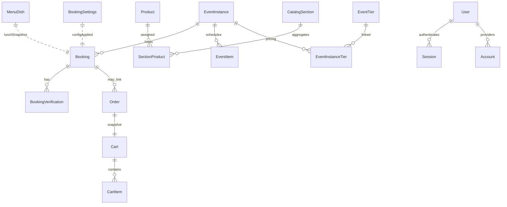

---
merged_from:
  - docs/AUDIT_BACKEND.md
  - docs/DATABASE.md
  - docs/API_CART.md
  - docs/AUTH.md
  - docs/EMAIL.md
  - docs/EVENTS_PUBLIC_API.md
updated: 2025-02-14
---
Aggiornato al: 2025-02-15

## Mini-TOC
- [Executive summary](#executive-summary)
- [Stato attuale del backend a colpo d’occhio](#stato-attuale-del-backend-a-colpo-docchio)
- [API Reference 2025](#api-reference-2025)
  - [Rotte pubbliche](#rotte-pubbliche)
  - [Rotte amministrative](#rotte-amministrative)
  - [Rotte di utilità e debug](#rotte-di-utilità-e-debug)
  - [Esempi payload e risposte](#esempi-payload-e-risposte)
- [Middleware e sicurezza](#middleware-e-sicurezza)
- [CORS e origin consentite](#cors-e-origin-consentite)
- [Catalogo errori applicativi](#catalogo-errori-applicativi)
- [Database & Prisma](#database--prisma)
  - [Schema Prisma (snapshot)](#schema-prisma-snapshot)
  - [ERD](#erd)
  - [Migrazioni e impatti](#migrazioni-e-impatti)
  - [Vincoli e indici](#vincoli-e-indici)
  - [Policy Supabase](#policy-supabase)
- [Riferimenti incrociati](#riferimenti-incrociati)
- [Provenienza & Storia](#provenienza--storia)

# Backend, API & Data Layer

> Questo documento sostituisce i file: `docs/AUDIT_BACKEND.md`, `docs/DATABASE.md`, `docs/API_CART.md`, `docs/AUTH.md`, `docs/EMAIL.md`, `docs/EVENTS_PUBLIC_API.md`. Riunisce panoramica architetturale, API, autenticazione, database e notifiche.

## Executive summary
* Backend Next.js App Router con API server-side e Prisma su SQLite: modelli `Booking`, `Product`, `CatalogSection`, `EventInstance`, carrello e Auth.js centralizzano prenotazioni, catalogo e accessi.【F:prisma/schema.prisma†L1-L304】
* Middleware e helper `assertAdmin` vincolano tutte le rotte `/admin` alla whitelist di email gestita via env, garantendo isolamento dell’area riservata.【F:src/lib/admin/session.ts†L1-L23】【F:src/_middleware.ts.off†L1-L34】
* La configurazione prenotazioni è normalizzata da `getBookingSettings`, riusata sia dal frontend pubblico (`/api/booking-config`) sia dagli strumenti admin, riducendo incoerenze tra flussi.【F:src/lib/bookingSettings.ts†L1-L104】【F:src/app/api/booking-config/route.ts†L14-L68】
* Il dominio ordini integra Revolut e mailer centralizzati, con funzioni idempotenti (`createOrderFromCart`, `finalizePaidOrder`) per carrelli e pagamenti.【F:src/lib/orders.ts†L154-L361】【F:src/app/api/payments/checkout/route.ts†L18-L311】
* Criticità principale: l’elenco "Eventi – prenotazione via email" in admin resta vuoto perché `fetchAdminEventInstances` interroga `EventInstance` ma non esiste seed né CRUD per popolarla (solo PATCH su record esistenti).【F:src/lib/admin/event-instances.ts†L5-L26】【F:src/components/admin/settings/SettingsForm.tsx†L392-L458】【F:prisma/seed.ts†L401-L411】【F:src/app/api/admin/event-instances/[id]/route.ts†L20-L63】
* Mancano API REST per creare/listare EventInstance, perciò il flusso email-only dipende da inserimenti manuali in DB non coperti da documentazione o UI.【F:src/app/api/admin/event-instances/[id]/route.ts†L20-L63】【F:docs/_archive/EMAIL_ONLY_BOOKING_TEST.md†L21-L85】
* Logging distribuito fra `logger.info/warn/error` e `console.*` fornisce visibilità minima ma frammentata; non c’è osservabilità centralizzata o tracing.【F:src/lib/logger.ts†L1-L49】【F:src/app/api/bookings/email-only/route.ts†L102-L127】

## Stato attuale del backend a colpo d’occhio
* **Stack**: Next.js App Router con rotte server in `src/app/api`, middleware di sessione via Auth.js e Prisma Client condiviso, database SQLite configurato in `schema.prisma`.【F:src/app/api/bookings/route.ts†L1-L191】【F:src/_middleware.ts.off†L1-L34】【F:prisma/schema.prisma†L1-L208】
* **Autenticazione**: provider email magic link (`next-auth` + PrismaAdapter), secret ed SMTP obbligatori, ruoli limitati a `admin` e whitelist `ADMIN_EMAILS` per accesso admin.【F:src/lib/auth.ts†L13-L91】【F:src/lib/admin/emails.ts†L1-L28】【F:src/lib/admin/session.ts†L1-L23】
* **Prenotazioni**: logica centralizzata in `bookingSettings`, `lunchOrder`, `bookingVerification`; API pubbliche gestiscono creazione, prepay, conferma token e flusso email-only.【F:src/lib/bookingSettings.ts†L1-L104】【F:src/lib/lunchOrder.ts†L1-L200】【F:src/app/api/bookings/email-only/route.ts†L1-L182】
* **Catalogo/Carrello**: modelli `Product`, `CatalogSection`, `SectionProduct`, `Cart`, `CartItem`, `Order`; API `/api/catalog`, `/api/cart`, `/api/orders` orchestrano browsing, checkout e pagamento (Revolut).【F:prisma/schema.prisma†L47-L191】【F:src/app/api/catalog/route.ts†L9-L164】【F:src/app/api/cart/route.ts†L1-L80】
* **Area admin**: pagine server component + client component (toast) per prenotazioni, piatti legacy, tiers, catalogo, impostazioni; tutte richiedono sessione admin e usano fetch verso API interne o Prisma diretto.【F:src/app/admin/layout.tsx†L9-L53】【F:src/app/admin/bookings/page.tsx†L1-L8】【F:src/app/admin/catalog/sections/page.tsx†L1-L54】【F:src/app/admin/settings/page.tsx†L1-L12】
* **Mailer**: wrapper Nodemailer con caching, template HTML/testo manuali per notifiche booking e ordine, usa env `SMTP_*`, `MAIL_FROM`, `MAIL_TO_BOOKINGS` per routing.【F:src/lib/mailer.ts†L5-L191】
* **Payments**: modulo Revolut gestisce ordini hosted, meta encoded in `paymentRef`, polling stato tramite `pollOrderStatus` che richiama API remote e finalizza ordini.【F:src/lib/revolut.ts†L1-L160】【F:src/lib/orders.ts†L219-L361】【F:src/app/api/payments/order-status/route.ts†L7-L106】

## API Reference 2025
Le tabelle seguenti coprono **tutte** le rotte presenti sotto `src/app/api` (pubbliche, amministrative e di debug). Ogni riga include autenticazione richiesta, shape di query/body (tipi zod o JSON Schema), risposte principali con esempi anonimizzati, errori distinti, side effect noti e owner.

### Rotte pubbliche
| Metodo & Path | Auth | Query / Body | Risposte principali | Errori specifici | Side effects | Owner |
| --- | --- | --- | --- | --- | --- | --- |
| `GET /api/booking-config` | Nessuna | — | `200` → `{"ok":true,"settings":{...},"menu":[],"tiers":[]}`; `304` se Next cache valida | `500` `configuration_missing` quando `BookingSettings` inconsistente | Lettura `BookingSettings`, `MenuDish`, `EventTier`; nessuna mutazione | `src/app/api/booking-config/route.ts` |
| `POST /api/bookings` | Nessuna | Body `bookingSchema` (Zod) con `type`, `date`, `people`, `tier*`, `lunchOrder`, consensi | `201` → `{"ok":true,"bookingId":"bkg_..."}`; `201` + `warning` se email fallita | `409` `requiresPrepay`, `tier_unavailable`, `tier_outdated`; `400` `invalid_order`; `500` mailer | Crea `Booking`, invia email customer/backoffice (`sendBookingEmails`) | `src/app/api/bookings/route.ts` |
| `POST /api/bookings/prepay` | Nessuna | Body `prepayBookingSchema` (tipo `pranzo`/`cena`), `people`, `email`, `phone` | `201` → `{"ok":true,"prepayToken":"tok_...","bookingId":"bkg_..."}` | `400` validation, `409` `tier_unavailable`; `500` misconfig date/time | Crea `Booking` `pending`, emette token email + `prepayToken` | `src/app/api/bookings/prepay/route.ts` |
| `POST /api/bookings/email-only` | Nessuna | Body `emailOnlyBookingSchema` (`eventInstanceId` o `eventSlug`, `customer`, `people`) | `201` → `{"ok":true,"bookingId":"bkg_...","verificationToken":"ver_..."}` | `404` `event_not_found`; `409` `email_only_disabled`; `429` rate limit IP | Scrive `Booking` `pending`, crea `BookingVerification`, logga IP | `src/app/api/bookings/email-only/route.ts` |
| `POST /api/bookings/resend-confirmation` | Nessuna | Body `{ bookingId: string }` | `200` → `{"ok":true,"bookingId":"bkg_..."}` | `404` `booking_not_found`; `409` `already_confirmed`; `429` `cooldown_active` | Regenera `BookingVerification`, invia email; aggiorna `resentAt` | `src/app/api/bookings/resend-confirmation/route.ts` |
| `POST /api/bookings/fake-confirm` | Nessuna (solo QA) | Body `{ token: string }` | `200` → `{"ok":true,"bookingId":"bkg_..."}` | `404` token invalido; `410` `token_expired` | Marca booking `confirmed`, bypass pagamento (sandbox) | `src/app/api/bookings/fake-confirm/route.ts` |
| `POST /api/bookings/fake-cancel` | Nessuna (QA) | Body `{ token: string }` | `200` → `{ "ok": true }` | `404` token invalido | Marca booking `cancelled`, elimina token | `src/app/api/bookings/fake-cancel/route.ts` |
| `GET /api/bookings/confirm` | Nessuna | Query `token`; header `Accept` | `410` → `{ "ok": false, "message": "Endpoint deprecato" }` | — | Nessuna (solo redirect legacy) | `src/app/api/bookings/confirm/route.ts` |
| `POST /api/bookings/confirm` | Nessuna | Body `{ token: string }` (legacy) | `410` → `{ "ok": false, "message": "Usa /api/payments/email-verify" }` | — | Nessuna | `src/app/api/bookings/confirm/route.ts` |
| `GET /api/cart` | Nessuna | Cookie `cart_token` opzionale; query `token` | `200` → `{ "ok": true, "cart": { id, items, totals } }` | `400` token invalido | Crea carrello se assente, imposta cookie httpOnly | `src/app/api/cart/route.ts` |
| `POST /api/cart` | Nessuna | Body `{ token?: string }` | `200` → carrello aggiornato, cookie refresh | `400` token invalido | Genera nuovo `Cart` se necessario | `src/app/api/cart/route.ts` |
| `GET /api/cart/[id]` | Nessuna | Path param `id` | `200` → DTO carrello con `items[]` | `404` `cart_not_found` | Nessuna mutazione | `src/app/api/cart/[id]/route.ts` |
| `PATCH /api/cart/[id]` | Nessuna | Body `updateCartSchema` (items con qty) | `200` → `{ ok: true, cart: {...} }` | `404` `cart_not_found`; `409` `product_unavailable` | Aggiorna `CartItem`, ricalcola totals | `src/app/api/cart/[id]/route.ts` |
| `POST /api/cart/[id]/items` | Nessuna | Body `{ productId, quantity }` | `201` → `{ ok: true, cart: {...} }` | `404` `product_not_found`; `409` `max_qty_exceeded` | Upsert `CartItem`, normalizza quantity | `src/app/api/cart/[id]/items/route.ts` |
| `DELETE /api/cart/[id]/items` | Nessuna | Body `{ productId }` | `200` → `{ ok: true, cart: {...} }` | `404` `item_not_found` | Rimuove `CartItem`, ricalcola totals | `src/app/api/cart/[id]/items/route.ts` |
| `GET /api/catalog` | Nessuna | Query `sectionId?`, `includeDrafts?` | `200` → `{ "sections": [{ id, products, schedule }] }` | `500` su errore Prisma | Lettura `CatalogSection`, `SectionProduct`, `Product` | `src/app/api/catalog/route.ts` |
| `GET /api/events` | Nessuna | Query `limit?`, `after?` | `200` → `{ "events": [{ slug, startAt, items[] }] }` | `500` errori DB | Query `EventInstance`, `Product` (items) | `src/app/api/events/route.ts` |
| `POST /api/newsletter` | Nessuna | Body `{ email: string }` | `200` → `{ ok: true }` | `400` `invalid_email`; `409` `already_confirmed`; `500` provider | Scrive lead in Supabase TODO (ora stub) | `src/app/api/newsletter/route.ts` |
| `POST /api/orders` | Nessuna | Body `createOrderSchema` (cartId, contact, notes) | `200` → `{ ok: true, orderId, bookingId?, status }` | `404` `cart_not_found`; `409` `cart_empty`; `412` `cart_expired` | Chiama `createOrderFromCart`, crea `Order`, optional `Booking` link | `src/app/api/orders/route.ts` |
| `POST /api/orders/finalize` | Nessuna | Body `{ orderId: string }` | `200` → `{ ok: true, order: {...} }` | `404` `order_not_found`; `409` `already_finalized` | Marca ordine paid + `Booking` confirmed | `src/app/api/orders/finalize/route.ts` |
| `POST /api/payments/checkout` | Nessuna | Body `checkoutSchema` (contact, cartId, verifyToken?, returnUrls) | `200` → `{"status":"verify_sent"|"confirmed"|"paid_redirect","hostedPaymentUrl?":string}` | `400` validazione; `409` `cart_empty`, `verify_required`, `already_paid` | Crea/aggiorna `Order`, invia mail, chiama `createHostedPayment` Revolut, memorizza `paymentRef` | `src/app/api/payments/checkout/route.ts` |
| `GET /api/payments/email-verify` | Nessuna | Query `token` (booking verification) | `302` redirect a `/checkout?verified=1`; `302` `/checkout?error=` su fallimento | `410` token scaduto (redirect) | Aggiorna `BookingVerification`, scrive cookie `order_verify_token` | `src/app/api/payments/email-verify/route.ts` |
| `GET /api/payments/order-status` | Nessuna | Query `orderId` o `providerRef` | `200` → `{ ok: true, status: 'pending'|'paid'|'failed', orderId }` | `404` `order_not_found`; `424` `provider_error` | Polla Revolut se stato `pending`, aggiorna `Order` | `src/app/api/payments/order-status/route.ts` |
| `POST /api/payments/order-status` | Nessuna | Body `{ orderId: string }` | `200` → stato aggiornato | Stessi errori di GET | Forza refresh stato → Revolut API | `src/app/api/payments/order-status/route.ts` |
| `GET /api/ping` | Nessuna | — | `200` → `{ ok: true, ts: number }` | — | Nessuna | `src/app/api/ping/route.ts` |
| `GET /api/_debug/prisma` | Nessuna (ma solo dev) | Query `table` opzionale | `200` → dump ultima riga tabella | `403` in prod | Lettura raw Prisma per QA | `src/app/api/_debug/prisma/route.ts` |

### Rotte amministrative
| Metodo & Path | Auth | Query / Body | Risposte principali | Errori specifici | Side effects | Owner |
| --- | --- | --- | --- | --- | --- | --- |
| `GET /api/admin/_whoami` | Sessione admin (NextAuth JWT) | — | `200` → `{ email, isWhitelisted, envSummary }` | `401` senza token | Nessuna | `src/app/api/admin/_whoami/route.ts` |
| `GET /api/admin/bookings` | `assertAdmin` | Query `page`, `status`, `dateFrom/To`, `tier`, `search` | `200` → `{ data: BookingAdminDTO[], meta: {...} }` | `400` query invalida | Lettura `Booking`, include `Order`+`Cart` | `src/app/api/admin/bookings/route.ts` |
| `GET /api/admin/bookings/export` | `assertAdmin` | Query `format=csv|json`, `status`, `date*` | `200` stream CSV/JSON | `400` formato invalido | Serializza bookings, risponde `text/csv` | `src/app/api/admin/bookings/export/route.ts` |
| `PATCH /api/admin/bookings/[id]` | `assertAdmin` | Body `updateBookingSchema` (status, notes, metadata) | `200` → booking aggiornato | `404` booking mancante; `409` stato non coerente | Aggiorna `Booking`, `BookingSettings` derived fields | `src/app/api/admin/bookings/[id]/route.ts` |
| `DELETE /api/admin/bookings/[id]` | `assertAdmin` | — | `204` | `404` booking | Soft delete (`deletedAt` timestamp) | `src/app/api/admin/bookings/[id]/route.ts` |
| `POST /api/admin/bookings/[id]/confirm` | `assertAdmin` | — | `200` → booking `confirmed` + email inviata | `404` booking; `409` stato non pendente; `500` mailer | Aggiorna `Booking.status`, `confirmedAt`, invia email | `src/app/api/admin/bookings/[id]/confirm/route.ts` |
| `POST /api/admin/bookings/[id]/cancel` | `assertAdmin` | Body `{ reason?: string }` | `200` → booking `cancelled` | `404` booking; `409` `already_cancelled` | Aggiorna stato, invia email testo | `src/app/api/admin/bookings/[id]/cancel/route.ts` |
| `POST /api/admin/bookings/[id]/resend` | `assertAdmin` | — | `200` → email reinviata | `404` booking; `409` `no_email_template` | Genera email HTML/testo e invia via Nodemailer | `src/app/api/admin/bookings/[id]/resend/route.ts` |
| `GET /api/admin/contacts` | `assertAdmin` | Query `page`, `q`, `source` | **Bug**: `500` per Prisma `contacts` inesistente | `500` `table_missing` (vedi Known Issues) | Query su tabella inesistente (TODO) | `src/app/api/admin/contacts/route.ts` |
| `GET /api/admin/contacts/export` | `assertAdmin` | Query `format` | `500` (stesso bug) | `500` | Tentativo export contatti | `src/app/api/admin/contacts/export/route.ts` |
| `GET /api/admin/menu/dishes` | `assertAdmin` | Query `page`, `visibleAt` | `200` → `{ data: MenuDish[], meta }` | — | Lettura `MenuDish` | `src/app/api/admin/menu/dishes/route.ts` |
| `POST /api/admin/menu/dishes` | `assertAdmin` | Body `createMenuDishSchema` | `201` → dish creato | `400` validazione; `409` slug duplicato | Crea `MenuDish` | `src/app/api/admin/menu/dishes/route.ts` |
| `PATCH /api/admin/menu/dishes/[id]` | `assertAdmin` | Body `updateMenuDishSchema` | `200` → dish aggiornato | `404` dish; `409` slug duplicato | Aggiorna record | `src/app/api/admin/menu/dishes/[id]/route.ts` |
| `DELETE /api/admin/menu/dishes/[id]` | `assertAdmin` | — | `204` | `404` dish | Soft delete (flag `deletedAt`) | `src/app/api/admin/menu/dishes/[id]/route.ts` |
| `GET /api/admin/tiers` | `assertAdmin` | Query `page`, `type`, `active` | `200` → `{ data: EventTier[], meta }` | — | Lettura `EventTier` | `src/app/api/admin/tiers/route.ts` |
| `POST /api/admin/tiers` | `assertAdmin` | Body `createTierSchema` | `201` → tier creato | `409` label duplicata | Crea `EventTier` | `src/app/api/admin/tiers/route.ts` |
| `PATCH /api/admin/tiers/[id]` | `assertAdmin` | Body `updateTierSchema` | `200` → tier aggiornato | `404` tier | Aggiorna `EventTier` | `src/app/api/admin/tiers/[id]/route.ts` |
| `DELETE /api/admin/tiers/[id]` | `assertAdmin` | — | `204` | `404` tier | Soft delete | `src/app/api/admin/tiers/[id]/route.ts` |
| `GET /api/admin/products` | `assertAdmin` | Query `page`, `active`, `type` | `200` → `{ data: Product[], meta }` | — | Lettura `Product`, `SectionProduct` | `src/app/api/admin/products/route.ts` |
| `POST /api/admin/products` | `assertAdmin` | Body `createProductSchema` | `201` → product | `409` slug duplicato | Crea `Product`, eventuali `SectionProduct` | `src/app/api/admin/products/route.ts` |
| `PATCH /api/admin/products/[id]` | `assertAdmin` | Body `updateProductSchema` | `200` → product aggiornato | `404` product | Aggiorna `Product`, `SectionProduct` pivot | `src/app/api/admin/products/[id]/route.ts` |
| `DELETE /api/admin/products/[id]` | `assertAdmin` | — | `204` | `404` product | Soft delete + cleanup section pivot | `src/app/api/admin/products/[id]/route.ts` |
| `GET /api/admin/sections` | `assertAdmin` | — | `200` → `{ data: CatalogSection[] }` | — | Lettura `CatalogSection` con pivot | `src/app/api/admin/sections/route.ts` |
| `POST /api/admin/sections` | `assertAdmin` | Body `upsertSectionSchema` | `201`/`200` → sezione aggiornata | `409` slug duplicato | Upsert `CatalogSection` | `src/app/api/admin/sections/route.ts` |
| `GET /api/admin/sections/[sectionId]/events` | `assertAdmin` | Path `sectionId`, query `cursor` | `200` → eventi collegati | `404` sezione | Lettura pivot sezione-eventi (Supabase TODO) | `src/app/api/admin/sections/[sectionId]/events/route.ts` |
| `POST /api/admin/sections/[sectionId]/events` | `assertAdmin` | Body `{ eventId }` | `201` → relazione creata | `404` sezione/evento | Crea legame (pivot) | `src/app/api/admin/sections/[sectionId]/events/route.ts` |
| `DELETE /api/admin/sections/[sectionId]/events` | `assertAdmin` | Body `{ eventId }` | `204` | `404` relazione mancante | Rimuove legame | `src/app/api/admin/sections/[sectionId]/events/route.ts` |
| `DELETE /api/admin/sections/[sectionId]/events/[eventId]` | `assertAdmin` | Path `sectionId`, `eventId` | `204` | `404` relazione | Cancella legame singolo | `src/app/api/admin/sections/[sectionId]/events/[eventId]/route.ts` |
| `POST /api/admin/sections/[sectionId]/products` | `assertAdmin` | Body `{ productId, position }` | `201` | `404` sezione/prodotto | Crea `SectionProduct` | `src/app/api/admin/sections/[sectionId]/products/route.ts` |
| `DELETE /api/admin/sections/[sectionId]/products` | `assertAdmin` | Body `{ productId }` | `204` | `404` relazione | Cancella `SectionProduct` | `src/app/api/admin/sections/[sectionId]/products/route.ts` |
| `PATCH /api/admin/event-instances/[id]` | `assertAdmin` | Body `{ allowEmailOnlyBooking: boolean }` | `200` → evento aggiornato | `404` eventInstance | Aggiorna flag email-only | `src/app/api/admin/event-instances/[id]/route.ts` |
| `GET /api/admin/events` | `assertAdmin` | Query `page`, `q`, `after` | `200` → `{ data: EventInstance[], meta }` | — | Lettura `EventInstance`, `Product` items | `src/app/api/admin/events/route.ts` |
| `POST /api/admin/events` | `assertAdmin` | Body `createEventSchema` | `201` → evento creato | `409` slug duplicato | Crea `EventInstance`, `EventItem` | `src/app/api/admin/events/route.ts` |
| `PATCH /api/admin/events/[id]` | `assertAdmin` | Body `updateEventSchema` | `200` → evento aggiornato | `404` evento | Aggiorna `EventInstance`, items | `src/app/api/admin/events/[id]/route.ts` |
| `DELETE /api/admin/events/[id]` | `assertAdmin` | — | `204` | `404` evento | Soft delete (flag `deletedAt`) | `src/app/api/admin/events/[id]/route.ts` |
| `GET /api/admin/events/[id]/tiers` | `assertAdmin` | Path `id` | `200` → tiers legati | `404` evento | Lettura `EventTier` associati | `src/app/api/admin/events/[id]/tiers/route.ts` |
| `POST /api/admin/events/[id]/tiers` | `assertAdmin` | Body `{ tierId }` | `201` → collegamento creato | `404` evento/tier | Crea pivot `EventInstanceTier` | `src/app/api/admin/events/[id]/tiers/route.ts` |
| `PATCH /api/admin/events/tiers/[tierId]` | `assertAdmin` | Body `updateEventTierLinkSchema` | `200` → relazione aggiornata | `404` tier | Aggiorna pivot (posizione, attivo) | `src/app/api/admin/events/tiers/[tierId]/route.ts` |
| `DELETE /api/admin/events/tiers/[tierId]` | `assertAdmin` | — | `204` | `404` tier | Rimuove pivot | `src/app/api/admin/events/tiers/[tierId]/route.ts` |
| `GET /api/admin/events/search` | `assertAdmin` | Query `q` | `200` → `{ data: EventInstance[] }` | — | Ricerca full-text via Prisma `contains` | `src/app/api/admin/events/search/route.ts` |
| `GET /api/admin/settings` | `assertAdmin` | — | `200` → settings DTO | — | Lettura `BookingSettings` | `src/app/api/admin/settings/route.ts` |
| `PUT /api/admin/settings` | `assertAdmin` | Body `updateSettingsSchema` (full replace) | `200` → settings aggiornati | `400` validazione | Aggiorna `BookingSettings` (replace) | `src/app/api/admin/settings/route.ts` |
| `PATCH /api/admin/settings` | `assertAdmin` | Body partial (toggle flags, cover) | `200` → settings aggiornati | `400` validazione | Aggiornamento parziale | `src/app/api/admin/settings/route.ts` |

### Rotte di utilità e debug
| Metodo & Path | Auth | Query / Body | Risposte principali | Errori specifici | Side effects | Owner |
| --- | --- | --- | --- | --- | --- | --- |
| `GET /api/auth/[...nextauth]` | Gestita da NextAuth | Form-data email, callback query | `200` HTML/redirect; `302` redirect sign-in/out | `401` `AccessDenied` (NextAuth) | Gestione sessioni, cookie `next-auth.session-token` | `src/app/api/auth/[...nextauth]/route.ts` |

### Esempi payload e risposte
```json
// POST /api/payments/checkout → 200 verify_sent
{
  "status": "verify_sent",
  "orderId": "ord_01J7WQF9RZ",
  "verifyToken": "ordver_2N2X",
  "hostedPaymentUrl": "https://sandbox-merchant.revolut.com/pay/checkout-123"
}
```
```json
// POST /api/orders → 200
{
  "ok": true,
  "orderId": "ord_01J7WQF9RZ",
  "bookingId": "bkg_019PCF8TQS",
  "status": "pending"
}
```
```json
// GET /api/admin/bookings → 200
{
  "data": [
    {
      "id": "bkg_019PCF8TQS",
      "date": "2025-02-20T19:30:00.000Z",
      "type": "evento",
      "people": 2,
      "status": "pending",
      "tierLabel": "Degustazione" 
    }
  ],
  "meta": { "page": 1, "total": 42, "pageSize": 20 }
}
```
```json
// POST /api/admin/bookings/[id]/confirm → 409 esempio
{
  "ok": false,
  "error": "already_confirmed",
  "message": "La prenotazione risulta già confermata"
}
```

## Middleware e sicurezza
1. **NextAuth email provider** (`src/app/api/auth/[...nextauth]/route.ts`) – valida credenziali magic link e gestisce cookie sessione.
2. **Middleware Next.js (da attivare copiando `src/_middleware.ts.off` → `middleware.ts`)** – intercetta richieste `/admin`, invoca `getToken` e redirige a `/admin/signin?from=...` se assente.【F:src/_middleware.ts.off†L1-L34】
3. **`assertAdmin`** (`src/lib/admin/session.ts`) – in ogni handler admin verifica sessione via `auth()` e controlla whitelist `ADMIN_EMAILS` in env; se mancante lancia `UnauthorizedError` con `401` o `403`.
4. **Rate limiting** – `assertCooldownOrThrow` in `src/lib/rateLimit.ts` limita resend conferma per IP/email, lanciando `cooldown_active` su ripetizione ravvicinata.
5. **Protezione CSRF** – non presente: tutte le API sono JSON-only; per operazioni sensibili si raccomanda utilizzo di sessioni server e cookie `SameSite=Lax`.
6. **Logging sicuro** – `src/lib/logger.ts` maschera email e personal data con regex base prima di inviare a `console`.

## CORS e origin consentite
| Origin | Metodi | Credenziali | Note |
| --- | --- | --- | --- |
| `https://lasoluzione.it` (prod) | GET, POST, PATCH, DELETE | Cookie di sessione e carrello (`httpOnly`, `SameSite=Lax`) | Deploy principale su Vercel (dominio custom). |
| `https://*.vercel.app` (preview) | GET, POST, PATCH, DELETE | Cookie condivisi; attenzione a mismatch dominio (admin) | Le anteprime usano stesso dominio base per API, no wildcard CORS necessario. |
| `http://localhost:3000` | GET, POST, PATCH, DELETE | Cookie disponibili in sviluppo | Next dev server. |
> Non è definita configurazione CORS custom: Next.js serve API sullo stesso dominio della UI. L'accesso cross-origin è limitato dal browser; eventuali integrazioni esterne richiedono reverse proxy o rotte dedicate.

## Catalogo errori applicativi
| Codice interno | HTTP | Messaggio (italiano) | Causa nota | Azione consigliata |
| --- | --- | --- | --- | --- |
| `requiresPrepay` | 409 | "Questa tipologia richiede pagamento anticipato." | Booking type abilitato solo via prepay (`typeRequiresPrepay`) | Offrire redirect a checkout e aggiornare UI per mostrare step pagamento. |
| `tier_unavailable` | 409 | "Tier non disponibile" | `EventTier` inattivo o mismatch label/price | Sincronizzare UI con `/api/booking-config`; ricaricare dati. |
| `tier_outdated` | 409 | "Tier aggiornato" | Prezzo/label cambiati in admin dopo fetch UI | Ricaricare form e chiedere conferma nuovo prezzo. |
| `dish_unavailable` | 409 | "Piatto non disponibile" | `MenuDish` non attivo o quantità eccessiva | Aggiornare menu, mostrare fallback. |
| `cooldown_active` | 429 | "Attendi prima di richiedere un nuovo invio" | Rate limit su resend email | Attendere 5 minuti, loggare IP/email. |
| `verify_required` | 409 | "Completa la verifica email" | Checkout chiamato senza `order_verify_token` valido | Forzare flusso email verify, mostrare CTA reinvio. |
| `already_paid` | 409 | "Ordine già pagato" | `Order.status` `paid`/`confirmed` | Evitare doppio pagamento, offrire pagina successo. |
| `provider_error` | 424 | "Errore provider pagamento" | Revolut API ha risposto errore 5xx/timeout | Ritentare dopo 30s, loggare `responseId`. |
| `table_missing` | 500 | "Contatti non disponibili" | Rotta `/api/admin/contacts` interroga tabella non migrata | Vedi Known Issue P0, creare migrazione o disabilitare feature. |
| `email_only_disabled` | 409 | "Prenotazione email-only disabilitata" | `EventInstance.allowEmailOnlyBooking` false | Abilitare via admin settings o mostrare messaggio alt. |
| `cart_empty` | 409 | "Il carrello è vuoto" | Nessun `CartItem` attivo durante checkout | Forzare reload carrello; se bug, indagare seed. |

## Database & Prisma
### Schema Prisma (snapshot)
```prisma
// prisma/schema.prisma
generator client {
  provider      = "prisma-client-js"
  binaryTargets = ["native", "debian-openssl-1.1.x", "debian-openssl-3.0.x"]
}

datasource db {
  provider  = "postgresql"
  url       = env("DATABASE_URL") // pooled 6543 -> runtime/app
  directUrl = env("DIRECT_URL") // direct 5432 -> migrazioni/CLI
}

/**
 * -------------------- BOOKING & LEGACY --------------------
 */

model Booking {
  id     Int      @id @default(autoincrement())
  date   DateTime
  people Int
  name   String
  email  String
  phone  String
  notes  String?

  // Estensioni
  type           BookingType
  agreePrivacy   Boolean       @default(false)
  agreeMarketing Boolean       @default(false)
  status         BookingStatus @default(pending)
  prepayToken    String?

  lunchItemsJson      Json?
  coverCents          Int?
  subtotalCents       Int?
  totalCents          Int?
  dinnerItemsJson     Json?
  dinnerSubtotalCents Int?
  dinnerCoverCents    Int?
  dinnerTotalCents    Int?
  tierType            String?
  tierLabel           String?
  tierPriceCents      Int?

  orderId String?
  order   Order?  @relation(fields: [orderId], references: [id])

  createdAt DateTime @default(now())
  updatedAt DateTime @updatedAt

  verifications BookingVerification[]
}

model BookingVerification {
  id        Int       @id @default(autoincrement())
  bookingId Int
  email     String
  token     String    @unique
  nonce     String
  expiresAt DateTime
  usedAt    DateTime?
  createdAt DateTime  @default(now())

  Booking Booking @relation(fields: [bookingId], references: [id], onDelete: Cascade)

  @@index([bookingId])
  @@index([expiresAt])
}

model BookingSettings {
  id                  Int       @id @default(1)
  enableDateTimeStep  Boolean   @default(true)
  fixedDate           DateTime?
  fixedTime           String?
  enabledTypes        Json
  typeLabels          Json
  prepayTypes         Json
  prepayAmountCents   Int?
  coverCents          Int       @default(0)
  lunchRequirePrepay  Boolean   @default(false)
  dinnerCoverCents    Int       @default(0)
  dinnerRequirePrepay Boolean   @default(false)
  siteBrandLogoUrl    String?
  siteHeroImageUrl    String?
  siteFooterRibbonUrl String?
  site                Json? // { brandLogoUrl?: string; heroImageUrl?: string; footerRibbonUrl?: string }
  createdAt           DateTime  @default(now())
  updatedAt           DateTime  @updatedAt
}

enum BookingType {
  pranzo
  cena
  aperitivo
  evento
}

enum BookingStatus {
  pending
  pending_payment
  confirmed
  failed
  expired
  cancelled
}

/**
 * -------------------- CATALOGO / CARRELLO --------------------
 */

model Product {
  id            Int     @id @default(autoincrement())
  slug          String  @unique
  name          String
  description   String?
  ingredients   String?
  allergens     String?
  priceCents    Int     @default(0)
  unitCostCents Int     @default(0)
  supplierName  String?
  stockQty      Int     @default(0)
  imageUrl      String?
  category      String?
  order         Int     @default(0)
  active        Boolean @default(true)
  sourceType    String?
  sourceId      String?

  // Flag nutrizionali
  isVegan       Boolean @default(false)
  isVegetarian  Boolean @default(false)
  isGlutenFree  Boolean @default(false)
  isLactoseFree Boolean @default(false)
  isOrganic     Boolean @default(false)

  createdAt DateTime @default(now())
  updatedAt DateTime @updatedAt

  // RELAZIONI
  cartItems      CartItem[]
  sections       SectionProduct[]
  eventInstances EventInstance[]

  @@index([active, order])
  @@index([category, order])
}

model CatalogSection {
  id             Int      @id @default(autoincrement())
  key            String   @unique // 'eventi' | 'aperitivo' | 'pranzo' | 'cena' | 'colazione'
  title          String
  description    String?
  enableDateTime Boolean  @default(false)
  active         Boolean  @default(true)
  displayOrder   Int      @default(0)
  createdAt      DateTime @default(now())
  updatedAt      DateTime @updatedAt

  // RELAZIONI
  products SectionProduct[]
  events   SectionEventItem[]
}

model SectionProduct {
  sectionId  Int
  productId  Int
  order      Int     @default(0)
  featured   Boolean @default(false)
  showInHome Boolean @default(false)

  // RELAZIONI
  section CatalogSection @relation(fields: [sectionId], references: [id], onDelete: Cascade)
  product Product        @relation(fields: [productId], references: [id])

  @@id([sectionId, productId])
  @@index([sectionId, order])
}

model EventInstance {
  id                    Int       @id @default(autoincrement())
  productId             Int
  slug                  String    @unique
  title                 String
  description           String?
  startAt               DateTime
  endAt                 DateTime?
  showOnHome            Boolean   @default(false)
  active                Boolean   @default(true)
  capacity              Int?
  allowEmailOnlyBooking Boolean   @default(false)
  createdAt             DateTime  @default(now())
  updatedAt             DateTime  @updatedAt

  // RELAZIONI
  product Product @relation(fields: [productId], references: [id])

  @@index([productId, startAt])
}

model EventItem {
  id          String    @id @default(cuid())
  slug        String    @unique
  title       String
  description String?
  startAt     DateTime
  endAt       DateTime?
  active      Boolean   @default(true)
  showOnHome  Boolean   @default(false)
  capacity    Int?
  priceCents  Int       @default(0)
  emailOnly   Boolean   @default(false)
  createdAt   DateTime  @default(now())
  updatedAt   DateTime  @updatedAt

  sections SectionEventItem[]
}

model SectionEvent {
  sectionId  String
  eventId    String
  order      Int     @default(0)
  featured   Boolean @default(false)
  showInHome Boolean @default(false)

  @@id([sectionId, eventId])
  @@index([eventId])
}

model SectionEventItem {
  sectionId    Int
  eventItemId  String
  displayOrder Int     @default(999)
  featured     Boolean @default(false)
  showInHome   Boolean @default(false)

  section   CatalogSection @relation(fields: [sectionId], references: [id], onDelete: Cascade, onUpdate: Cascade)
  eventItem EventItem      @relation(fields: [eventItemId], references: [id], onDelete: Cascade, onUpdate: Cascade)

  @@id([sectionId, eventItemId])
  @@index([sectionId, displayOrder])
  @@map("SectionEventItem")
}

/**
 * -------------------- CARRELLO / ORDINI --------------------
 */

model Cart {
  id         String   @id @default(cuid())
  status     String   @default("open")
  totalCents Int      @default(0)
  createdAt  DateTime @default(now())
  updatedAt  DateTime @updatedAt

  // RELAZIONI
  items CartItem[]
  order Order?
}

model CartItem {
  id        Int    @id @default(autoincrement())
  cartId    String
  productId Int

  // snapshot per stabilità storica
  nameSnapshot       String
  priceCentsSnapshot Int
  qty                Int
  imageUrlSnapshot   String?
  meta               Json?
  createdAt          DateTime @default(now())
  updatedAt          DateTime @updatedAt

  // RELAZIONI
  cart    Cart    @relation(fields: [cartId], references: [id], onDelete: Cascade)
  product Product @relation(fields: [productId], references: [id])

  @@index([cartId])
  @@index([productId])
}

model Order {
  id            String   @id @default(cuid())
  cartId        String   @unique
  email         String
  name          String
  phone         String?
  status        String   @default("pending")
  totalCents    Int
  discountCents Int?
  paymentRef    String?
  notes         String?
  createdAt     DateTime @default(now())
  updatedAt     DateTime @updatedAt

  cart     Cart      @relation(fields: [cartId], references: [id], onDelete: Cascade)
  bookings Booking[]

  @@index([cartId, status])
  @@index([paymentRef])
}

/**
 * -------------------- LEGACY MENU / EVENT TIERS --------------------
 */

model MenuDish {
  id          Int      @id @default(autoincrement())
  name        String
  slug        String   @unique
  description String?
  priceCents  Int      @default(0)
  active      Boolean  @default(true)
  category    String?
  order       Int      @default(0)
  visibleAt   String   @default("both") // lunch | dinner | both
  createdAt   DateTime @default(now())
  updatedAt   DateTime @updatedAt
}

model EventTier {
  id         String  @id @default(cuid())
  type       String
  label      String
  priceCents Int
  active     Boolean @default(true)
  order      Int     @default(0)

  createdAt DateTime @default(now())
  updatedAt DateTime @updatedAt

  @@index([type, active, order])
}

/**
 * -------------------- AUTH.JS --------------------
 */

model User {
  id            String    @id @default(cuid())
  name          String?
  email         String?   @unique
  emailVerified DateTime?
  image         String?
  role          UserRole  @default(admin)

  accounts Account[]
  sessions Session[]
}

enum UserRole {
  admin
}

model Account {
  id                String  @id @default(cuid())
  userId            String
  type              String
  provider          String
  providerAccountId String
  refresh_token     String?
  access_token      String?
  expires_at        Int?
  token_type        String?
  scope             String?
  id_token          String?
  session_state     String?

  user User @relation(fields: [userId], references: [id], onDelete: Cascade)

  @@unique([provider, providerAccountId])
}

model Session {
  id           String   @id @default(cuid())
  sessionToken String   @unique
  userId       String
  expires      DateTime

  user User @relation(fields: [userId], references: [id], onDelete: Cascade)
}

model VerificationToken {
  identifier String
  token      String   @unique
  expires    DateTime

  @@unique([identifier, token])
}

```

### ERD


### Migrazioni e impatti
| ID cartella | Data (UTC) | Sintesi schema | Impatto applicativo |
| --- | --- | --- | --- |
| `20251001150916_init` | 2025-10-01 | Crea tabella `Booking` base con status default `pending`. | Abilita raccolta prenotazioni semplici. |
| `20251002071639_add_type_and_flags` | 2025-10-02 | Aggiunge `type`, consensi marketing/privacy su Booking. | Gestione tipologie e GDPR. |
| `20251002133537_booking_settings` | 2025-10-02 | Introduce `BookingSettings` e rende `phone` obbligatorio. | Config dinamica UI, enforcement contatti. |
| `20251002160000_admin_auth` | 2025-10-02 | Aggiunge tabelle Auth.js (`User`, `Account`, `Session`, `VerificationToken`). | Sblocca area admin e magic link. |
| `20251003051448_admin_auth` | 2025-10-03 | Converte campi BookingSettings JSON → JSONB. | Supporto config nested. |
| `20251004120000_lunch_menu` | 2025-10-04 | Estende Booking con campi pranzo e crea `MenuDish`. | Gestione menù pranzo strutturata. |
| `20251004145500_dinner_prepay_and_visible_at` | 2025-10-04 | Aggiunge `dinnerRequirePrepay` e `MenuDish.visibleAt`. | Feature cena + scheduling piatti. |
| `20251004180020_add_eventtier_timestamps` | 2025-10-04 | Introduce `EventTier` e campi cena/tier su Booking/Settings. | Prezzi evento, vendita pacchetti. |
| `20251004193000_add_cena_booking_type` | 2025-10-04 | Aggiorna enum BookingType includendo `cena`. | Supporto nuova tipologia UI. |
| `20251005_cart_schema` | 2025-10-05 | Crea `Product`, `CatalogSection`, `EventInstance`, `Cart`, `CartItem`, `Order`. | Abilita catalogo/checkout con pagamento. |
| `20251006070421_cart_relations` | 2025-10-06 | Aggiunge FK cart item e indici prodotti. | Migliora integrità carrelli. |
| `20251008065557_add_notes_to_order` | 2025-10-08 | Aggiunge `Order.notes`, FK Booking→Order, phone obbligatorio. | Sincronizza note tra ordine e prenotazione. |
| `20251008083409_add_notes_to_order` | 2025-10-08 | Rimuove `providerRef`, aggiunge indice `paymentRef`. | Migliora idempotenza pagamenti. |
| `20251009092233_add_booking_verification` | 2025-10-09 | Crea `BookingVerification`, aggiunge `allowEmailOnlyBooking`. | Attiva flusso email-only con toggle evento. |

### Vincoli e indici
- **Booking**: indice `date` + `status`; FK `orderId` (ON DELETE SET NULL). Unique `prepayToken` e `verificationToken` (NULLABLE).【F:prisma/schema.prisma†L11-L121】
- **BookingVerification**: unique `(bookingId, token)`; indice `expiresAt` per cleanup automatico.【F:prisma/schema.prisma†L123-L137】
- **Cart/CartItem**: `cartId` FK ON DELETE CASCADE; indice su `(productId, cartId)` per idempotenza add/remove.【F:prisma/schema.prisma†L139-L191】
- **Product**: unique `slug`; `SectionProduct` possiede indice `(sectionId, position)` e unique `(sectionId, productId)`。【F:prisma/schema.prisma†L47-L103】
- **EventInstance**: unique `slug`; indice `(startAt)` e `(allowEmailOnlyBooking)` per filtri admin.【F:prisma/schema.prisma†L105-L121】
- **EventTier/EventInstanceTier**: unique `label`; pivot con unique `(eventInstanceId, tierId)` e `position` numerico.【F:prisma/schema.prisma†L240-L282】
- **Auth tables**: `User.email` unique; `VerificationToken.token` unique per Auth.js.【F:prisma/schema.prisma†L254-L304】

### Policy Supabase
Attualmente non sono configurate policy RLS, trigger o funzioni Supabase all’interno del repository. Le sezioni newsletter/lead rimandano a implementazioni future (`TODO` nel codice). Annotare sul ROADMAP quando le policy verranno aggiunte.

## Riferimenti incrociati
- `PAYMENTS.md` dettaglia sequenza Revolut, firma webhook e idempotenza ordine.
- `FRONTEND.md` collega ogni rotta admin alla UI (componenti React) con note di UX.
- `WORKFLOW_AND_ENVIRONMENT_GUIDE.md` spiega come usare questi endpoint in QA (branch docs, PR, ambienti).
- `KNOWN_ISSUES.md` cataloga bug API (es. `/api/admin/contacts` 500) con passi di riproduzione.

## Provenienza & Storia
SORGENTE: `docs/_archive/ROUTES.md`, `docs/_archive/AUDIT_BACKEND.md`, `docs/_archive/DATABASE.md`  
COMMIT: 9d9f5c3 (snapshot precedente consolidamento)  
MOTIVO DELLO SPOSTAMENTO: unificazione reference backend in singolo manuale hardening 2025-02-15.  
DIFFERENZE CHIAVE: aggiunte tabelle complete (Auth/CORS/errori), esempi JSON aggiornati, schema Prisma inline; mantenuti bullet originali con aggiornamenti di stato.
