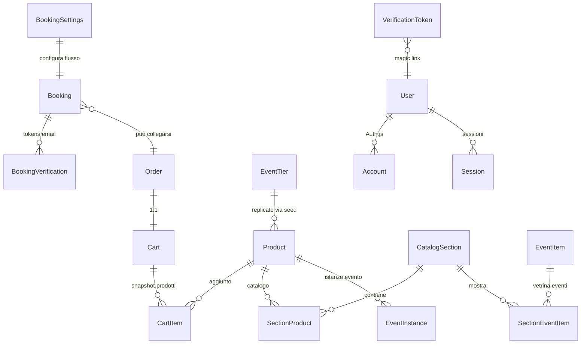

# Database & Prisma

## Diagramma ER (schema corrente)


## Modelli chiave
- **Booking**: prenotazioni legacy e derivate dal checkout; snapshot ordine (`*_Json`, `tier*`), relazione opzionale con `Order`.
- **BookingVerification**: token email-only con `token @unique`, `nonce`, `expiresAt`, `usedAt`.
- **BookingSettings**: singola riga (`id=1`) con configurazione wizard (cover, tipi, prepagato).
- **Cart / CartItem**: carrello persistente via cookie; `Cart.status` (`open`, `locked`, ...), `CartItem` conserva snapshot prodotto.
- **Order**: 1:1 con `Cart` (`cartId @unique`), stato pagamento (`status` string), `paymentRef` (metadati Revolut), relazione inversa `Booking[]`.
- **CatalogSection / SectionProduct**: definiscono vetrine e ordering dei `Product` (chiave composta `sectionId_productId`).
- **EventInstance**: eventi programmati collegati ad un `Product` (usato per prezzi e copy). `allowEmailOnlyBooking` abilita flow senza pagamento.
- **EventItem / SectionEventItem**: futura vetrina eventi (seed/migrazione già predisposta).
- **MenuDish / EventTier**: entità legacy che alimentano prodotti e pacchetti via seed.
- **Auth.js (`User`, `Account`, `Session`, `VerificationToken`)**: gestiscono magic link e sessioni JWT.

## Migrazioni
- Migrazione iniziale Postgres: `prisma/migrations/20251013115652_init_postgres` (include enum `BookingType`, `BookingStatus`, `UserRole`).
- `prisma/migrations/migration_lock.toml` è generato automaticamente; non modificarlo manualmente.

### Ambiente di sviluppo
```bash
pnpm prisma migrate dev            # applica nuove migrazioni al DB locale (usa DATABASE_URL)
pnpm tsx prisma/seed.ts            # aggiorna dati di esempio (idempotente)
```
- Assicurati che `DIRECT_URL` punti alla porta diretta (5432) se usi Supabase: Prisma CLI usa `directUrl` per migrazioni.
- Per ripristinare da zero: `pnpm prisma migrate reset --force` seguito da `pnpm tsx prisma/seed.ts` (⚠️ cancella i dati).

### Deploy / produzione
```bash
pnpm prisma migrate deploy         # esegue le migrazioni in ambiente non interattivo
pnpm prisma generate               # rigenera il client (eseguito anche da postinstall se non disabilitato)
```
- Prima del deploy, esporta un backup (`pg_dump`) dal database Supabase:
  ```bash
  pg_dump "${DIRECT_URL}" --format=c --file backup-before-release.dump
  ```
- In Vercel assicurati che `DIRECT_URL` (non solo `DATABASE_URL`) sia impostato tra gli env secrets per evitare errori `P1001` durante `migrate deploy`.

### Cambio provider (SQLite → PostgreSQL)
1. Aggiorna `datasource db` in `prisma/schema.prisma` a `provider = "postgresql"` (già configurato).
2. Genera una nuova migrazione `pnpm prisma migrate dev --name switch_to_postgres` contro un database Postgres vuoto.
3. Copia i dati rilevanti (dump SQLite → import). In Supabase usa `pgloader` o script ETL.
4. Aggiorna `DATABASE_URL`/`DIRECT_URL` negli ambienti. Rimuovi file `.db` legacy.
5. Esegui `pnpm prisma migrate deploy` in produzione.

## Seed (`prisma/seed.ts`)
Il seed è idempotente e produce output log per verificare il completamento:
- `seedAdminUsers()` legge `ADMIN_EMAILS` e crea/aggiorna utenti admin (`User.role='admin'`).
- `seedMenuDishes()` popola `MenuDish` con piatti dimostrativi.
- `bridgeMenuDishesToProducts()` converte piatti in `Product` e collega a sezioni `pranzo`/`cena`.
- `seedEventTiers()` e `bridgeEventTiersToProducts()` creano prodotti per pacchetti evento/aperitivo.
- `seedCatalogSections()` garantisce le sezioni base (`eventi`, `aperitivo`, `pranzo`, `cena`, `colazione`).
- `seedBookingSettings()` imposta `BookingSettings` default (cover 2€, tipi abilitati, flag prepagato).
- `seedSingleEventInstance()` crea prodotto `serata-capodanno` + evento `capodanno-2025` (abilita email-only).
- Log finali: numero prodotti collegati da menu/tier (`[seed] Products bridged from ...`).

Per aggiornare manualmente il catalogo dopo modifiche legacy, riesegui `pnpm tsx prisma/seed.ts` (non cancella dati esistenti, aggiorna/inserisce).

## Backup e ripristino
- **Backup manuale**: `pg_dump` su Supabase con formato compresso (`--format=c`). Archivia su storage sicuro.
- **Ripristino**: `pg_restore --clean --if-exists --dbname "$DATABASE_URL" backup.dump` seguito da `pnpm prisma migrate deploy` se necessario.
- **Verifiche post-ripristino**: lancia `pnpm prisma db pull` per validare che lo schema corrisponda e prova `/api/ping` per health check.

## Monitoraggio
- Prisma log: `src/lib/prisma.ts` abilita log `warn/error` in sviluppo. Per debugging aggiungere `DEBUG=* pnpm dev`.
- `prisma/_dev` route (`src/app/_dev/prisma-debug.route.ts`) restituisce info di connessione (solo in sviluppo) per verificare env.
