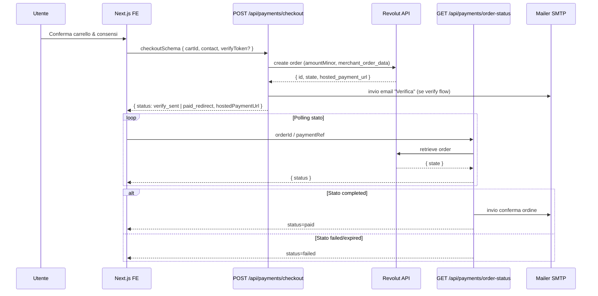

---
merged_from:
  - docs/REVOLUT.md
  - docs/revolut-audit.md
updated: 2025-02-14
---
Aggiornato al: 2025-02-15

## Mini-TOC
- [Pagamenti & Integrazione Revolut](#pagamenti--integrazione-revolut)
  - [Stato ambienti & prerequisiti](#stato-ambienti--prerequisiti)
  - [Variabili d'ambiente](#variabili-dambiente)
  - [Sequenza end-to-end](#sequenza-end-to-end)
  - [API applicative coinvolte](#api-applicative-coinvolte)
  - [Webhook Revolut (da implementare)](#webhook-revolut-da-implementare)
  - [Matrice stati prenotazione e ordine](#matrice-stati-prenotazione-e-ordine)
  - [Idempotenza e storage temporaneo](#idempotenza-e-storage-temporaneo)
  - [Error handling & retry](#error-handling--retry)
  - [Checklist operativa](#checklist-operativa)
- [Riferimenti incrociati](#riferimenti-incrociati)
- [Provenienza & Storia](#provenienza--storia)

# Pagamenti & Integrazione Revolut

> Questo documento sostituisce: `docs/REVOLUT.md`, `docs/revolut-audit.md`. Consultare l'appendice per la cronologia merge e i riferimenti originali.

## Stato ambienti & prerequisiti
| Ambiente | Stato | Endpoint configurati | Note |
| --- | --- | --- | --- |
| **Sandbox** | Attivo | `https://sandbox-merchant.revolut.com/api/1.0` (REST), hosted checkout | Utilizzato da `/api/payments/checkout`, nessun webhook configurato. |
| **Production** | TODO | `https://merchant.revolut.com/api/1.0` | Richiede rotazione chiavi e aggiornamento domini consentiti; attivare quando Roadmap Fase "Pagamenti live" completata. |

Prerequisiti:
1. Richiedere accesso al Merchant Dashboard (Team Finance) → sezione **API Keys** per generare `REVOLUT_SECRET_KEY` (server) e `checkout public token` (client).
2. Impostare domini consentiti in **Checkout → Allowed domains** includendo `https://*.vercel.app` e dominio custom produzione.
3. Popolare `.env.local`, `.env.production` (Vercel) e secret Supabase con le variabili elencate sotto.
4. Verificare che `NEXT_PUBLIC_CART_ENABLED=true` per esporre il checkout carrello (flusso pagamenti completo).

## Variabili d'ambiente
| Nome | Scope | Dove impostarla | Descrizione |
| --- | --- | --- | --- |
| `NEXT_PUBLIC_REVOLUT_ENV` | client | `.env.local`, Vercel | `sandbox` o `prod`, guida il widget JS. |
| `NEXT_PUBLIC_REVOLUT_PUBLIC_KEY` | client | `.env.local`, Vercel | Token pubblico checkout; obbligatorio per popup embedded. |
| `REVOLUT_SECRET_KEY` | server | Vercel (Secret), Supabase (se functions), `.env.local` | Chiave privata REST utilizzata da `revolutFetch`. |
| `REVOLUT_API_BASE` | server | opzionale | Override base URL (default `https://sandbox-merchant.revolut.com`). |
| `REVOLUT_API_VERSION` | server | opzionale | Versione API (default `2024-09-01`). |
| `PAY_RETURN_URL` | server | `.env.local`, Vercel | URL assoluto di ritorno (default `/checkout/return`). |
| `PAY_CANCEL_URL` | server | `.env.local`, Vercel | URL annullo (default `/checkout/cancel`). |
| `MAIL_TO_BOOKINGS` | server | `.env.local`, Vercel | Destinatario email conferma ordine pagato. |
| `MAIL_FROM` | server | `.env.local`, Vercel | Mittente email (usato per ricevute). |

## Sequenza end-to-end


## API applicative coinvolte
| Fase | Endpoint | Descrizione | Riferimento |
| --- | --- | --- | --- |
| Creazione ordine | `POST /api/payments/checkout` | Valida carrello, costruisce ordine Revolut, salva `paymentRef`. | `BACKEND.md` → Rotte pubbliche. |
| Polling & finalizzazione | `GET/POST /api/payments/order-status` | Aggiorna `Order.status`, avvia email conferma. | `BACKEND.md`. |
| Verifica email-only | `GET /api/payments/email-verify` | Consuma token verificazione e imposta cookie `order_verify_token`. | `BACKEND.md`. |
| Consolidamento prenotazione | `POST /api/orders/finalize` | Marca ordine pagato e collega `Booking`. | `BACKEND.md`. |

## Webhook Revolut (da implementare)
> Attualmente **non esiste** una rotta webhook in produzione. Questa sezione definisce la specifica consigliata per l’implementazione (ROADMAP fase Pagamenti live).

| Campo | Valore proposto |
| --- | --- |
| URL | `POST https://lasoluzione.it/api/payments/revolut-webhook` (deploy Vercel). |
| Metodo | `POST` JSON. |
| Headers | `Revolut-Signature`, `Revolut-Timestamp`, `Content-Type: application/json`. |
| Algoritmo firma | HMAC SHA256 sul body con `REVOLUT_WEBHOOK_SECRET`. |
| Payload esempio |
| |
```json
{
  "id": "event_01J7X5...",
  "type": "order.completed",
  "data": {
    "order_id": "b3c2f9b0-...",
    "merchant_order_data": {
      "reference": "ord_01J7WQF9RZ"
    },
    "state": "completed",
    "amount_minor": 12400,
    "currency": "EUR",
    "customer": {
      "email": "utente@example.com"
    }
  }
}
```
| Verifica firma | 1) Recuperare `Revolut-Timestamp`. 2) Concatenare `${timestamp}.${rawBody}`. 3) Calcolare HMAC SHA256 con secret. 4) Confrontare con `Revolut-Signature` (timing safe). |
| Idempotenza | Utilizzare header `Idempotency-Key` se presente, altrimenti `data.order_id`. Persistenza consigliata: tabella `WebhookEvent` con indice unique `(provider, providerId)`. |
| Storage eventi | In attesa di implementazione: vedere `ROADMAP.md` (milestone "Revolut webhook & payouts"). |

## Matrice stati prenotazione e ordine
| Stato Booking | Stato Order | Transizione valida da | Trigger | Note |
| --- | --- | --- | --- | --- |
| `pending` | `pending` | Creazione via `/api/bookings/prepay` o `/api/payments/checkout` (verify) | API server | Attesa verifica email o pagamento. |
| `pending_payment` | `pending` | Checkout con `requiresPrepay=true` ma ordine non completato | `/api/payments/checkout` | UI deve mostrare CTA pagamento. |
| `confirmed` | `paid` | Polling `order-status` riceve `completed` oppure admin `confirm` | `/api/payments/order-status`, `/api/admin/bookings/[id]/confirm` | Invio email conferma; `Cart` marcato come finalizzato. |
| `failed` | `failed` | Revolut restituisce `failed`/`declined` | Polling / webhook | UI deve offrire riprova o supporto. |
| `expired` | `cancelled` | Timeout 15 min (TODO scheduler) | Cron job (roadmap) | Attualmente non automatizzato; manuale. |
| `cancelled` | `cancelled` | Azione admin o API `fake-cancel` | `/api/admin/bookings/[id]/cancel` | Invia email testo se SMTP configurato. |

## Idempotenza e storage temporaneo
- **`paymentRef`** (`src/lib/paymentRef.ts`): serializza provider (`revolut`), `orderId`, `hostedPaymentUrl`, timestamp e `verifyToken`. Salva JSON stringato in `Order.paymentRef`. | Funge da chiave idempotenza per `createHostedPayment`.
- **`order_verify_token`**: cookie httpOnly scritto da `/api/payments/email-verify`; utilizzato per impedire doppi checkout finché il token non viene consumato.
- **`BookingVerification`**: previene multiple conferme email-only, scadenza 30 minuti (campo `expiresAt`).

## Error handling & retry
| Scenario | Fonte | Azione automatica | Retry manuale | Log raccomandati |
| --- | --- | --- | --- | --- |
| Timeout Revolut (fetch > 10s) | `revolutFetch` | Ritorna `provider_error` (HTTP 424) | Ritentare checkout → nuova chiamata API | Log `responseId`, `durationMs`, `orderId`. |
| Stato `pending` prolungato | Polling | Continua fino a 12 tentativi (circa 60s) | Admin verifica dashboard Revolut, eventuale annullo | Log `pollCount`, `lastStatus`. |
| Email conferma fallita | `sendOrderPaidEmail` | Ritorna `warning` in response API | Resend da admin → `/api/admin/bookings/[id]/resend` | Log `mailerError`, `smtpHost`. |
| Token verifica scaduto | `/api/payments/email-verify` | Redirect con `error=expired` | Utente può richiedere resend; admin può confermare manualmente | Log `token`, `bookingId`, `expiresAt`. |
| Webhook duplicato (futuro) | Handler webhook | Ignora se `WebhookEvent` esiste | — | Log `providerId`, `attempt`. |

## Checklist operativa
1. ✅ Conferma variabili in `.env.example` e Vercel Environment (Production/Preview).
2. ✅ Verifica che `REVOLUT_SECRET_KEY` e `NEXT_PUBLIC_REVOLUT_PUBLIC_KEY` siano ruotati ogni 90 giorni (policy sicurezza).
3. ✅ Test manuale sandbox:
   - Checkout ordine `>= 1` prodotto.
   - Pagamento carta test `5123 4500 0000 0008` + OTP `1234`.
   - Verifica email e pagina `/checkout/success` (status `paid`).
4. ✅ Monitorare log `provider_error` in Vercel e `logger.error` in `pollOrderStatus` dopo ogni deploy.
5. ✅ Prima di go-live production abilitare webhook e aggiornare `KNOWN_ISSUES.md` (rimuovere nota 500 se risolta).

## Riferimenti incrociati
- `BACKEND.md` — dettagli endpoint `/api/payments/*`, errori e side effects.
- `KNOWN_ISSUES.md` — bug aperti su polling, stati e rotte admin correlate.
- `ROADMAP.md` — milestone "Pagamenti live" con attivazione webhook e payout automatici.

## Provenienza & Storia
SORGENTE: `docs/REVOLUT.md`, `docs/revolut-audit.md`
COMMIT: 9d9f5c3
MOTIVO DELLO SPOSTAMENTO: consolidamento hardening pagamenti con nuove sezioni (sequenza, stati, env table).
DIFFERENZE CHIAVE: aggiunti diagramma sequence, specifica webhook proposta, matrice stati e checklist operativa.
