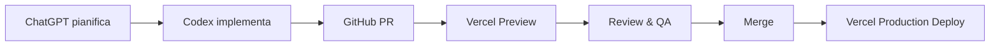
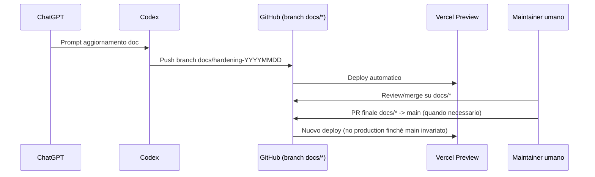

Aggiornato al: 2025-02-15

## Mini-TOC
- [La Soluzione — Guida Operativa Completa (Ambiente, Flussi, Branching, Deploy)](#la-soluzione--guida-operativa-completa-ambiente-flussi-branching-deploy)
  - [0) Glossario rapido](#0-glossario-rapido)
  - [1) Flussi end-to-end](#1-flussi-end-to-end)
  - [2) Strategia di branching](#2-strategia-di-branching)
  - [3) Strumenti operativi: passi guidati](#3-strumenti-operativi-passi-guidati)
  - [4) Pull Request: varianti e checklist](#4-pull-request-varianti-e-checklist)
  - [5) Vercel: Preview vs Production](#5-vercel-preview-vs-production)
  - [6) Supabase & dati](#6-supabase--dati)
  - [7) Lavorare in locale senza fare danni](#7-lavorare-in-locale-senza-fare-danni)
  - [8) Coordinare Codex e lavoro umano](#8-coordinare-codex-e-lavoro-umano)
  - [9) Processi chiave documentazione](#9-processi-chiave-documentazione)
  - [10) QA su Preview prima di main](#10-qa-su-preview-prima-di-main)
  - [11) Comandi CLI utili](#11-comandi-cli-utili)
- [Riferimenti incrociati](#riferimenti-incrociati)
- [Provenienza & Storia](#provenienza--storia)

# La Soluzione — Guida Operativa Completa (Ambiente, Flussi, Branching, Deploy)

> **Scopo**: questa guida rende autonomo chiunque (anche senza esperienza) nel lavorare sul repository **lasoluzione**, coordinando ChatGPT, Codex, GitHub, VS Code, GitHub Desktop, Vercel, Supabase e SiteGround. Contiene flussi _end‑to‑end_, procedure passo‑passo, checklist anti‑errore e strategie di branching/deploy.

---

## 0) Glossario rapido
| Ruolo/Strumento | Funzione | Note operative |
| --- | --- | --- |
| **ChatGPT (planner)** | Pianifica, stende promemoria, verifica coerenza doc. | Produce task list e revisiona output Codex. |
| **Codex (esecutore)** | Modifica file, esegue test, apre PR. | Lavora sempre su branch dedicati (`feat/*`, `fix/*`, `docs/*`). |
| **VS Code** | Editor locale per verifiche e fix manuali. | Usa estensioni Git e GitLens per controllare branch. |
| **GitHub Desktop** | Sincronizza branch locale ↔ remoto con UI. | Evita errori di branch e semplifica merge/pull. |
| **GitHub** | Gestione repository, PR, permessi. | Branch protection su `main`, review obbligatorie. |
| **Supabase** | Database/Postgres gestito; conserva dati preview/prod. | Gestire credenziali via Vercel env. |
| **Vercel** | Deploy automatico preview/production. | Preview su ogni PR/branch, Production su `main`. |
| **SiteGround/DNS** | Gestione dominio pubblico. | Record CNAME verso Vercel, TTL 300s consigliato. |

---

## 1) Flussi end-to-end

### 1.1 Flusso standard “da idea a produzione”

1. **ChatGPT** definisce scopo, vincoli, check.
2. **Codex** sviluppa su branch dedicato, apre PR.
3. **GitHub** esegue check, attiva preview.
4. **QA** su URL preview Vercel.
5. **Merge** su branch target (tipicamente `main`).
6. **Vercel** promuove deploy production.

### 1.2 Flusso “documentazione separata”


### 1.3 Flusso locale GitHub Desktop ↔ VS Code
```mermaid
flowchart LR
  GD[GitHub Desktop]
  VS[VS Code]
  GH[GitHub Remote]

  GH --> GD: Fetch / Pull
  GD --> VS: Apri repository
  VS --> GD: Commit stage & commento
  GD --> GH: Push origin/branch
```
Check rapido prima di ogni sessione: `Fetch` → conferma branch → `Pull` → solo allora modifica in VS Code.

---

## 2) Strategia di branching
| Branch | Uso | Regole |
| --- | --- | --- |
| `main` | Produzione. | Protetto. Solo PR approvate. Deploy automatico Vercel production. |
| `feat/*` | Nuove funzionalità. | Uno per feature, nominare con descrizione (`feat/admin-bookings-totale`). |
| `fix/*` | Bugfix puntuali. | Allinearsi con issue/ticket, includere test. |
| `docs/*` | Documentazione. | Nessun codice app; PR possono rimanere fuori da main. |
| `hotfix/*` | Patch urgenti. | Merge rapido → `main` + `production`.

**Regole d’oro**
- Mai committare su `main` direttamente.
- PR piccole, tematiche, con lista file.
- Ogni PR indica URL preview Vercel e checklist completata.
- Protezioni `main`: review obbligatoria, status Vercel verde, no force push.

---

## 3) Strumenti operativi: passi guidati

### 3.1 Creare un branch documentazione e non toccare `main`
1. **GitHub UI** → Branch menu → `New branch` → nome `docs/hardening-YYYYMMDD`.
2. **Screenshot**: 
3. Conferma che la base sia `main` (dropdown “Create from”).
4. Comunica il nome a Codex/ChatGPT per le attività.

**Checklist**
- [ ] Branch creato da `main` aggiornato.
- [ ] Nessun commit locale su `main` aperto.
- [ ] README del branch aggiornato (se necessario).

### 3.2 Aprire PR che non triggerano production (solo preview)
1. Su GitHub clicca `Compare & pull request` dal branch `docs/*` verso `docs/*` (o branch dedicato).
2. Nel form PR imposta `base: docs/...`, `compare: docs/...-update`.
3. **Screenshot**: 
4. Salva con titolo chiaro (es. `docs: hardening 2025-02-15`).

Checklist:
- [ ] Base branch ≠ `main`.
- [ ] Vercel indicator “Preview Ready”.
- [ ] Checklist PR (vedi `CHANGELOG.md`) compilata.

### 3.3 Fare merge su branch target ≠ `main`
1. Apri la PR su GitHub.
2. Seleziona `Merge pull request` → conferma.
3. **Screenshot**: 
4. Verifica che `main` non sia cambiato (nessun deploy production).

### 3.4 Passare contenuti da branch A→B senza cherry-pick casuali
1. Apri PR `branchA` → `branchB`.
2. Compila descrizione con sezione `From/To`.
3. Usa `Squash & merge` per unire commit multipli pulendo la storia.
4. Aggiorna `INDEX.md` con nuova provenienza.

### 3.5 Sincronizzare locale post-merge senza sovrascrivere
1. In GitHub Desktop: `Fetch origin` → `Pull origin branch`.
2. Se serve rebase: `Repository` → `Pull with Rebase`.
3. In terminale: `git fetch origin && git checkout branch && git rebase origin/main` (se branch basato su main).
4. Risolvi conflitti in VS Code (usa Source Control > Merge Editor).

### 3.6 Evitare commit nel branch sbagliato
- In VS Code controlla il nome branch nella status bar (in basso a sinistra).
- `git status` (CLI) prima del commit: conferma `On branch docs/...`.
- GitHub Desktop mostra banner rosso se tenti push su `main` protetto.
- Checklist rapida in sede commit: `[ ] Branch corretto`, `[ ] Messaggio coerente`, `[ ] Diff rivista`.

---

## 4) Pull Request: varianti e checklist

### 4.1 PR branch → main (flusso standard)
- Scopo: deploy produzione.
- Passi: sviluppa → apri PR su `main` → verifica preview → merge (Squash consigliato) → monitor deploy production.
- Checklist: `[ ] Tests`, `[ ] Preview QA`, `[ ] CHANGELOG`, `[ ] Checklist PR completata`.

### 4.2 PR Codex → branch non-main (aggiornare doc/code isolati)
- Target branch: `docs/...` o `staging`.
- Garantisce nessun deploy production.
- Ricordare di aggiornare `ROADMAP`/`INDEX` se toccati.

### 4.3 Promuovere documentazione da `docs/...` → `main`
- Apri PR `docs/...` → `main` quando serve pubblicare.
- QA su preview `docs/...` prima.
- Dopo merge, verifica che l’app non rigeneri bundle inutili (monitor build Vercel).

---

## 5) Vercel: Preview vs Production

### 5.1 Impostazioni chiave
- Production Branch: `main`.
- Preview: ogni PR/branch; URL formato `https://lasoluzione-git-<branch>.vercel.app`.
- Env: configurare `Production`, `Preview`, `Development` con variabili coerenti (vedi `PAYMENTS.md`).

### 5.2 Redeploy / rollback
- `Redeploy`: Vercel UI → Deployment → `Redeploy` (usa commit originale).
- `Deploy from branch`: Vercel UI → `New Deployment` → scegli branch/commit.
- `Rollback`: dal deployment history clic `Promote to Production` sul build precedente.

### 5.3 Simulare produzione senza toccare main
- Opzione A: mantenere branch `staging` con env identiche a production.
- Opzione B: clonare progetto Vercel e collegarlo a branch alternativo.
- Evitare di cambiare temporaneamente Production Branch (alto rischio). Documentare scelte in `DEVOPS.md`.

### 5.4 Runtime logs e diagnostica
- In Vercel → Deployments → seleziona build → scheda **Functions** → clic su `api/admin/contacts` (Edge/Serverless) per aprire i Runtime Logs.
- Ogni invocazione mostra `requestId`, codice e messaggio: errori Prisma/handler loggano `CONTACTS_QUERY_FAILED` con stack console (`console.error`).
- Per bug riproducibili, copia log completo (inclusi `statusCode` e `error`) e allegalo nella issue/PR insieme ai parametri di query usati.

---

## 6) Supabase & dati
- Credenziali gestite via Vercel (`DATABASE_URL`, `DIRECT_URL`).
- Migrazioni Prisma (`prisma/migrations`) devono essere eseguite manualmente su Supabase prima del deploy se non automatizzate.
- Per preview usare database separato o flag feature (evitare dati reali).
- Log accessi e policy RLS in `ROADMAP.md` (milestone sicurezza DB).

---

## 7) Lavorare in locale senza fare danni

### 7.1 Checklist quotidiana
- [ ] `Fetch` su GitHub Desktop.
- [ ] Confermare branch corrente.
- [ ] `Pull` / `Pull with Rebase` prima di modificare.
- [ ] Commit piccoli e descrittivi (`docs:`, `feat:`, `fix:`).
- [ ] Push e verifica PR/Preview.

### 7.2 Aggiornare branch con main
- GitHub Desktop → `Branch` → `Update from main` (merge) o `Pull with Rebase`.
- CLI: `git fetch origin && git checkout feat/... && git merge origin/main`.
- Risolvere conflitti con Merge Editor VS Code; testare preview dopo.

### 7.3 Debug branch sbagliato
- `git status` → se appare `On branch main` interrompere e `git checkout docs/...`.
- GitHub Desktop `History` per verificare commit precedenti.
- In caso di commit errato su main: `git reset HEAD~` e ripetere su branch corretto (se protetto, push rifiutato).

---

## 8) Coordinare Codex e lavoro umano

### Scenario A — Codex e umano sullo stesso branch
1. Codex push → appare su GitHub.
2. In locale `Pull` aggiornamenti.
3. Continua lavoro, risolvi conflitti, push.

### Scenario B — Codex apre PR verso branch non-main
1. Checkout branch target della PR.
2. Aggiungi commit → PR aggiornata.
3. QA su preview → merge.

### Scenario C — Portare solo alcune modifiche
- Usa PR dedicata con selezione file.
- In alternativa `git cherry-pick <sha>` (documenta in PR per trasparenza).

---

## 9) Processi chiave documentazione

### “Aggiornare documentazione senza toccare main”
1. Crea branch `docs/...` (vedi §3.1).
2. Codex lavora sul branch → PR verso lo stesso branch.
3. Merge PR (resti su `docs/...`).
4. Quando pronto, PR `docs/...` → `main`.
5. Aggiorna `INDEX.md`, `CHANGELOG.md`, checklist PR.

### “Aprire PR che non triggera produzione”
- Verifica base branch ≠ `main`.
- Nella PR aggiungi badge “Preview only”.
- Inserisci nel body: “Questa PR non deve essere mergiata su main (no deploy).”

### “Passare contenuti branch A→B via PR”
- Documenta nel body: `Source branch`, `Target branch`, `Motivazione`.
- Includi sezione `Rischi` e `Test`.

### “Sincronizzare locale post-merge”
- Dopo merge su branch remoto: `git checkout branch && git pull`.
- Se merge da main, considerare `git rebase` per storia lineare.

---

## 10) QA su Preview prima di main
1. Sviluppa su `feat/...`.
2. Apri PR `feat/...` → `staging` (o branch QA).
3. Esegui checklist QA (vedi `TESTING.md`).
4. Solo dopo QA verde, PR `staging` → `main`.
5. Documenta in PR principale cosa è stato validato su preview.

---

## 11) Comandi CLI utili
```bash
# Clona il repo (prima volta)
git clone git@github.com:DanieleMarcon/lasoluzione.git
cd lasoluzione

# Passa a un branch documentazione
git checkout -b docs/hardening-20250215

git status      # verifica branch e file modificati
git pull --rebase origin main   # aggiorna branch dalla base

git add docs/README.md
git commit -m "docs: aggiorna entry point"
git push -u origin docs/hardening-20250215
```

---

## Riferimenti incrociati
- `README.md` — landing documentazione con mappa contenuti.
- `DEVOPS.md` — runbook incident, sicurezza e procedure avanzate Vercel/Supabase.
- `TESTING.md` — checklist QA da eseguire sui preview.
- `ROADMAP.md` — pianificazione iniziative (incluso go-live pagamenti, policy RLS Supabase).

## Provenienza & Storia
SORGENTE: `docs/WORKFLOW_AND_ENVIRONMENT_GUIDE.md` (versione 2025-02-14)  
COMMIT: 9d9f5c3  
MOTIVO DELLO SPOSTAMENTO: aggiunta mini-TOC, diagrammi mermaid, procedure passo-passo con checklist, allineamento alle direttive hardening.  
DIFFERENZE CHIAVE: contenuti originali mantenuti e riorganizzati, integrate immagini placeholder, checklist operative e riferimenti incrociati.
